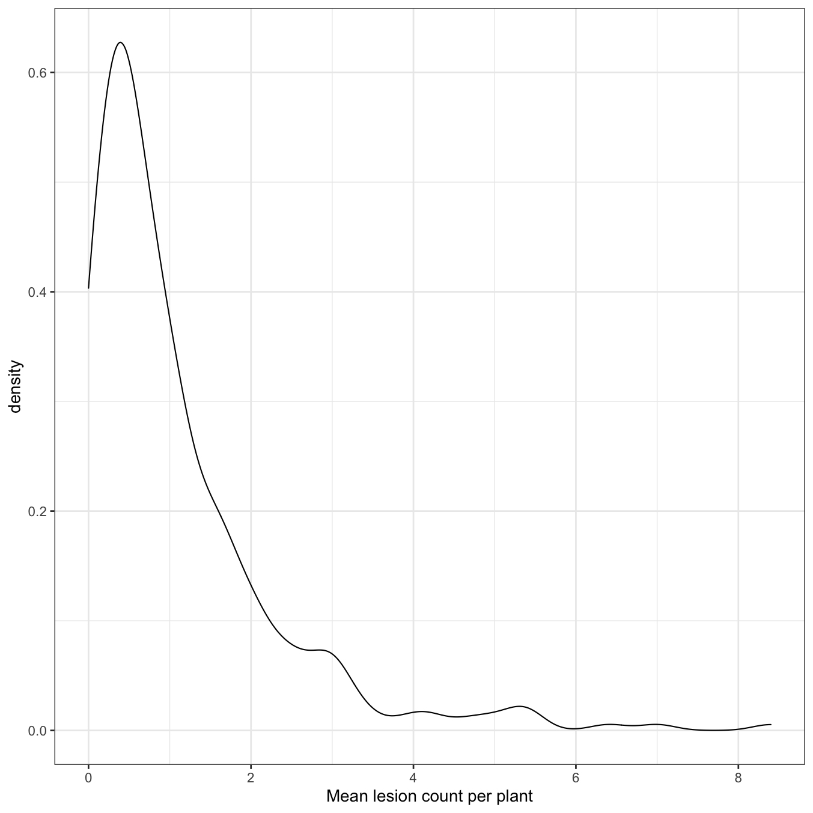

---
# Please do not edit this file directly; it is auto generated.
# Instead, please edit 10-visualise_data.md in _episodes_rmd/
title: "Visualise Lesion and Weather Data"
teaching: 60
exercises: 15
questions:
- "?"
- "?"
- "?"
objectives:
- ""
keypoints:
- ""
source: Rmd
---

### Load Libraries for This Exercise

Load libraries that will be used for this exercise.

~~~
library("tidyverse")
library("lubridate")
library("clifro")
library("viridis")
library("here")
library("ChickpeaAscoDispersal")

theme_set(theme_bw(base_size = 14))
~~~
{: .language-r}

## Visualise Counts per Pot

~~~
ggplot(lesion_counts, aes(x = m_lesions)) +
   geom_density() +
   xlab("Mean lesion count per plant")
~~~
{: .language-r}

## Visualise the Dispersal Data

~~~
ggplot(lesion_counts, aes(x = distance,
                          y = m_lesions)) +
   geom_count() +
   scale_size(breaks = c(1, 2, 4, 8)) +
   stat_summary(fun.y = "median",
                geom = "line",
                na.rm = TRUE) +
   stat_summary(
      fun.y = "median",
      colour = "red",
      size = 2,
      geom = "point"
   ) +
   scale_x_continuous(breaks = c(0, 10, 25, 50, 75)) +
   ylim(c(-0.5, 9)) +
   ylab("Mean lesion count values") +
   xlab("Distance (m)") +
   facet_wrap(. ~ SpEv, ncol = 3)
~~~
{: .language-r}

## Visualise the Rainfall

~~~
dat <- left_join(lesion_counts, cleaned_weather, by = c("site", "rep"))

dat %>%
   group_by(SpEv) %>%
   mutate(Hour = floor_date(time, "1 hour")) %>%
   group_by(SpEv, Hour) %>%
   summarize(sum(rainfall)) %>%
   ggplot(aes(x = Hour, y = `sum(rainfall)`)) +
   geom_col() +
   scale_x_datetime(
      "Date (day-month)",
      date_breaks = "day",
      date_labels = "%d-%m",
      date_minor_breaks = "hour",
      guide = guide_axis(check.overlap = TRUE)
   ) +
   ylab("Precipitation (mm)") +
   facet_wrap(. ~ SpEv, ncol = 3, scales = "free_x")
~~~
{: .language-r}

## Visualise the Wind Speed and Direction

~~~
pw <-
   with(
      dat,
      windrose(
         wind_speed,
         wind_direction,
         SpEv,
         n_col = 3,
         legend_title = "Wind speed (m/s)"
      )
   )
pw +
   scale_fill_viridis_d(name = "Wind Speed (m/s)", direction = -1) +
   xlab("") +
   theme_pubclean()
~~~
{: .language-r}

~~~
Error in theme_pubclean(): could not find function "theme_pubclean"
~~~
{: .error}

When inspecting these data, we noted that the wind direction for Curyo was against the direction of spread along the transects, which lead to further investigation of the weather data.

## Heatmap of Lesions Along Transects

~~~
heat_dat <-
   lesion_counts %>%
   group_by(SpEv, degrees) %>%
   mutate(summed_count_pot =
             case_when(distance == 0 ~ sum(m_lesions),
                       TRUE ~ m_lesions)) %>%
   filter(m_lesions > 0)

ggplot(data = heat_dat,
       aes(
          x = degrees,
          y = distance,
          colour = summed_count_pot,
          size = summed_count_pot
       )) +
   geom_count(data = subset(heat_dat, distance == 0)) +
   geom_count(data = subset(heat_dat, distance > 0)) +
   scale_colour_viridis_c(
      direction = -1,
      name = "n",
      guide = "legend",
      breaks = c(1, 5, 10, 15, 20)
   ) +
   coord_polar(theta = "x",
               start = 0,
               direction = 1) +
   scale_size(
      range = c(2, 8),
      name = "n",
      breaks = c(1, 5, 10, 15, 20)
   ) +
   scale_x_continuous(
      breaks = c(0, 90, 180, 270),
      expand = c(0, 0),
      limits = c(0, 360),
      labels = c("N", "E", "S", "W")
   ) +
   scale_y_continuous(breaks = c(0, 10, 25, 50, 75),
                      limits = c(0, 75)) +
   ylab("Distance (m)") +
   xlab("Transect") +
   facet_wrap(. ~ SpEv, ncol = 3)
~~~
{: .language-r}

