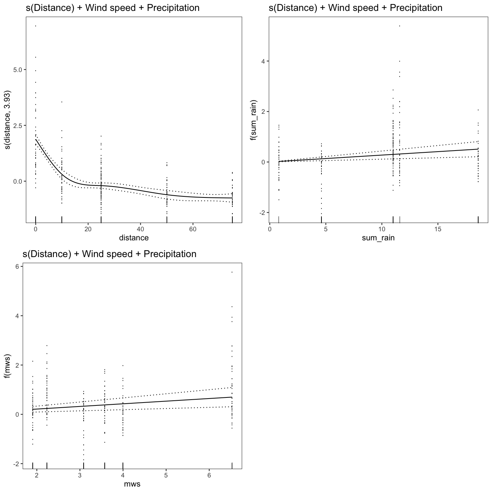

---
# Please do not edit this file directly; it is auto generated.
# Instead, please edit 11-fit_gam.md in _episodes_rmd/
title: "Fit and Compare Generalised Additive Models of Conidial Dispersal"
teaching: 45
exercises: 15
questions:
- "How can we use a generalised additive model (GAM) to represent conidial dispersal?"
- "What can the GAM tell us about the data?"
objectives:
- "Join different sets of data together for building a model."
- "Fit generalised additive models to data."
- "Determine which factors are necessary to include in the model."
- "Evaluate different models to determine which model provides the best fit."
- "Visualise a generalised additive model."
keypoints:
- "Generalised additive models are a powerful way to model non-linear relationships."
- "When fitting models to data, check many ways and compare."
- "There are no perfect models, only some that are better than others."
source: Rmd
---

In this episode we will explore how to fit and evaluate the best fitting model for our data.
I've chosen to use a generalised additive model for this work because as we saw in the data visualisation episode, the lesion count data is not linear, *i.e.* the lesion counts follow a curve not a straight line as you get farther from the source of inoculum.

### Load Libraries for This Exercise

Loading the `ChickpeaAscoDispersal` library will load the data we previously generated.

## Create Data Set for GAMs

Use `dplyr::left_join()` join the `lesion_counts` data and the `summary_weather` data to create `dat` for creating GAMs.
`left_join()` is a powerful tool for combining data sets based on one or more matching columns.

~~~
dat <-
   left_join(lesion_counts, summary_weather, by = c("site", "rep"))
~~~
{: .language-r}

## Fit GAMs

For reproducibility purposes, use `set.seed()`.

~~~
set.seed(27)
~~~
{: .language-r}

### mod1 - s(Distance)

~~~
mod1 <-
   gam(m_lesions ~ s(distance, k = 5),
       data = dat)

summary(mod1)
~~~
{: .language-r}

~~~

Family: gaussian 
Link function: identity 

Formula:
m_lesions ~ s(distance, k = 5)

Parametric coefficients:
            Estimate Std. Error t value Pr(>|t|)    
(Intercept)  1.08024    0.04751   22.74   <2e-16 ***
---
Signif. codes:  0 '***' 0.001 '**' 0.01 '*' 0.05 '.' 0.1 ' ' 1

Approximate significance of smooth terms:
              edf Ref.df    F p-value    
s(distance) 3.926  3.996 78.4  <2e-16 ***
---
Signif. codes:  0 '***' 0.001 '**' 0.01 '*' 0.05 '.' 0.1 ' ' 1

R-sq.(adj) =  0.482   Deviance explained = 48.8%
GCV = 0.76522  Scale est. = 0.75394   n = 334
~~~
{: .output}

~~~
print(p_gam(x = getViz(mod1)) +
         ggtitle("s(Distance)"),
      pages = 1)
~~~
{: .language-r}

~~~
mod1_vis <- getViz(mod1)
check(
   mod1_vis,
   a.qq = list(method = "tnorm",
               a.cipoly = list(fill = "light blue")),
   a.respoi = list(size = 0.5),
   a.hist = list(bins = 10)
)
~~~
{: .language-r}

~~~

Method: GCV   Optimizer: magic
Smoothing parameter selection converged after 9 iterations.
The RMS GCV score gradient at convergence was 1.559795e-06 .
The Hessian was positive definite.
Model rank =  5 / 5 

Basis dimension (k) checking results. Low p-value (k-index<1) may
indicate that k is too low, especially if edf is close to k'.

              k'  edf k-index p-value    
s(distance) 4.00 3.93    0.57  <2e-16 ***
---
Signif. codes:  0 '***' 0.001 '**' 0.01 '*' 0.05 '.' 0.1 ' ' 1
~~~
{: .output}

### mod2 - s(Distance) + Precipitation

~~~
mod2 <-
   gam(m_lesions ~ sum_rain + s(distance, k = 5),
       data = dat)

summary(mod2)
~~~
{: .language-r}

~~~

Family: gaussian 
Link function: identity 

Formula:
m_lesions ~ sum_rain + s(distance, k = 5)

Parametric coefficients:
            Estimate Std. Error t value Pr(>|t|)    
(Intercept) 0.772464   0.092471   8.354 1.89e-15 ***
sum_rain    0.031885   0.008278   3.852 0.000141 ***
---
Signif. codes:  0 '***' 0.001 '**' 0.01 '*' 0.05 '.' 0.1 ' ' 1

Approximate significance of smooth terms:
              edf Ref.df     F p-value    
s(distance) 3.928  3.996 81.76  <2e-16 ***
---
Signif. codes:  0 '***' 0.001 '**' 0.01 '*' 0.05 '.' 0.1 ' ' 1

R-sq.(adj) =  0.502   Deviance explained =   51%
GCV = 0.7366  Scale est. = 0.72352   n = 334
~~~
{: .output}

~~~
print(p_gam(x = getViz(mod2)) +
         ggtitle("s(Distance) + Precipitation"),
      pages = 1)
~~~
{: .language-r}

~~~
mod2_vis <- getViz(mod2)
check(
   mod2_vis,
   a.qq = list(method = "tnorm",
               a.cipoly = list(fill = "light blue")),
   a.respoi = list(size = 0.5),
   a.hist = list(bins = 10)
)
~~~
{: .language-r}

~~~

Method: GCV   Optimizer: magic
Smoothing parameter selection converged after 9 iterations.
The RMS GCV score gradient at convergence was 2.464141e-06 .
The Hessian was positive definite.
Model rank =  6 / 6 

Basis dimension (k) checking results. Low p-value (k-index<1) may
indicate that k is too low, especially if edf is close to k'.

              k'  edf k-index p-value    
s(distance) 4.00 3.93     0.6  <2e-16 ***
---
Signif. codes:  0 '***' 0.001 '**' 0.01 '*' 0.05 '.' 0.1 ' ' 1
~~~
{: .output}

### mod3 - s(Distance) + Wind speed

~~~
mod3 <-
   gam(m_lesions ~ mws + s(distance, k = 5),
       data = dat)

summary(mod3)
~~~
{: .language-r}

~~~

Family: gaussian 
Link function: identity 

Formula:
m_lesions ~ mws + s(distance, k = 5)

Parametric coefficients:
            Estimate Std. Error t value Pr(>|t|)    
(Intercept)  0.64401    0.11825   5.446 1.01e-07 ***
mws          0.12273    0.03059   4.012 7.47e-05 ***
---
Signif. codes:  0 '***' 0.001 '**' 0.01 '*' 0.05 '.' 0.1 ' ' 1

Approximate significance of smooth terms:
              edf Ref.df     F p-value    
s(distance) 3.929  3.996 81.99  <2e-16 ***
---
Signif. codes:  0 '***' 0.001 '**' 0.01 '*' 0.05 '.' 0.1 ' ' 1

R-sq.(adj) =  0.504   Deviance explained = 51.2%
GCV = 0.73389  Scale est. = 0.72086   n = 334
~~~
{: .output}

~~~
print(p_gam(x = getViz(mod3)) +
         ggtitle("s(Distance) + Wind speed"),
      pages = 1)
~~~
{: .language-r}

~~~
mod3_vis <- getViz(mod3)
check(
   mod3_vis,
   a.qq = list(method = "tnorm",
               a.cipoly = list(fill = "light blue")),
   a.respoi = list(size = 0.5),
   a.hist = list(bins = 10)
)
~~~
{: .language-r}

~~~

Method: GCV   Optimizer: magic
Smoothing parameter selection converged after 9 iterations.
The RMS GCV score gradient at convergence was 1.636288e-06 .
The Hessian was positive definite.
Model rank =  6 / 6 

Basis dimension (k) checking results. Low p-value (k-index<1) may
indicate that k is too low, especially if edf is close to k'.

              k'  edf k-index p-value    
s(distance) 4.00 3.93    0.58  <2e-16 ***
---
Signif. codes:  0 '***' 0.001 '**' 0.01 '*' 0.05 '.' 0.1 ' ' 1
~~~
{: .output}

### mod4 - s(Distance) + Wind speed + Precipitation

~~~
mod4 <-
   gam(m_lesions ~ sum_rain + mws + s(distance, k = 5),
       data = dat)

summary(mod4)
~~~
{: .language-r}

~~~

Family: gaussian 
Link function: identity 

Formula:
m_lesions ~ sum_rain + mws + s(distance, k = 5)

Parametric coefficients:
            Estimate Std. Error t value Pr(>|t|)    
(Intercept) 0.435675   0.132265   3.294 0.001096 ** 
sum_rain    0.027392   0.008239   3.325 0.000986 ***
mws         0.106960   0.030507   3.506 0.000518 ***
---
Signif. codes:  0 '***' 0.001 '**' 0.01 '*' 0.05 '.' 0.1 ' ' 1

Approximate significance of smooth terms:
              edf Ref.df     F p-value    
s(distance) 3.931  3.996 84.56  <2e-16 ***
---
Signif. codes:  0 '***' 0.001 '**' 0.01 '*' 0.05 '.' 0.1 ' ' 1

R-sq.(adj) =  0.519   Deviance explained = 52.8%
GCV = 0.71426  Scale est. = 0.69944   n = 334
~~~
{: .output}

~~~
print(p_gam(x = getViz(mod4)) +
         ggtitle("s(Distance) + Wind speed + Precipitation"),
      pages = 1)
~~~
{: .language-r}

~~~
mod4_vis <- getViz(mod4)
check(
   mod4_vis,
   a.qq = list(method = "tnorm",
               a.cipoly = list(fill = "light blue")),
   a.respoi = list(size = 0.5),
   a.hist = list(bins = 10)
)
~~~
{: .language-r}

~~~

Method: GCV   Optimizer: magic
Smoothing parameter selection converged after 9 iterations.
The RMS GCV score gradient at convergence was 2.433456e-06 .
The Hessian was positive definite.
Model rank =  7 / 7 

Basis dimension (k) checking results. Low p-value (k-index<1) may
indicate that k is too low, especially if edf is close to k'.

              k'  edf k-index p-value    
s(distance) 4.00 3.93     0.6  <2e-16 ***
---
Signif. codes:  0 '***' 0.001 '**' 0.01 '*' 0.05 '.' 0.1 ' ' 1
~~~
{: .output}

### mod5 - s(Distance + Wind Speed) + Precipitation

~~~
mod5 <-
   gam(m_lesions ~ sum_rain + s(distance + mws, k = 5),
       data = dat)
~~~
{: .language-r}

~~~
Warning in term[i] <- attr(terms(reformulate(term[i])), "term.labels"): number
of items to replace is not a multiple of replacement length
~~~
{: .warning}

~~~
summary(mod5)
~~~
{: .language-r}

~~~

Family: gaussian 
Link function: identity 

Formula:
m_lesions ~ sum_rain + s(distance + mws, k = 5)

Parametric coefficients:
            Estimate Std. Error t value Pr(>|t|)    
(Intercept) 0.772464   0.092471   8.354 1.89e-15 ***
sum_rain    0.031885   0.008278   3.852 0.000141 ***
---
Signif. codes:  0 '***' 0.001 '**' 0.01 '*' 0.05 '.' 0.1 ' ' 1

Approximate significance of smooth terms:
              edf Ref.df     F p-value    
s(distance) 3.928  3.996 81.76  <2e-16 ***
---
Signif. codes:  0 '***' 0.001 '**' 0.01 '*' 0.05 '.' 0.1 ' ' 1

R-sq.(adj) =  0.502   Deviance explained =   51%
GCV = 0.7366  Scale est. = 0.72352   n = 334
~~~
{: .output}

~~~
print(p_gam(x = getViz(mod5)) +
         ggtitle("s(Distance + Wind Speed) + Precipitation"),
      pages = 1)
~~~
{: .language-r}

~~~
mod5_vis <- getViz(mod5)
check(
   mod5_vis,
   a.qq = list(method = "tnorm",
               a.cipoly = list(fill = "light blue")),
   a.respoi = list(size = 0.5),
   a.hist = list(bins = 10)
)
~~~
{: .language-r}

~~~

Method: GCV   Optimizer: magic
Smoothing parameter selection converged after 9 iterations.
The RMS GCV score gradient at convergence was 2.464141e-06 .
The Hessian was positive definite.
Model rank =  6 / 6 

Basis dimension (k) checking results. Low p-value (k-index<1) may
indicate that k is too low, especially if edf is close to k'.

              k'  edf k-index p-value    
s(distance) 4.00 3.93     0.6  <2e-16 ***
---
Signif. codes:  0 '***' 0.001 '**' 0.01 '*' 0.05 '.' 0.1 ' ' 1
~~~
{: .output}

### mod6 - s(Distance) + s(Wind Speed) + Precipitation

~~~
mod6 <-
   gam(m_lesions ~ sum_rain + s(distance, k = 5) + s(mws, k = 5),
       data = dat)

summary(mod6)
~~~
{: .language-r}

~~~

Family: gaussian 
Link function: identity 

Formula:
m_lesions ~ sum_rain + s(distance, k = 5) + s(mws, k = 5)

Parametric coefficients:
            Estimate Std. Error t value Pr(>|t|)    
(Intercept)  1.40355    0.18004   7.796 8.82e-14 ***
sum_rain    -0.03349    0.01810  -1.850   0.0652 .  
---
Signif. codes:  0 '***' 0.001 '**' 0.01 '*' 0.05 '.' 0.1 ' ' 1

Approximate significance of smooth terms:
              edf Ref.df     F  p-value    
s(distance) 3.938  3.997 93.81  < 2e-16 ***
s(mws)      3.926  3.995 12.66 9.89e-10 ***
---
Signif. codes:  0 '***' 0.001 '**' 0.01 '*' 0.05 '.' 0.1 ' ' 1

R-sq.(adj) =  0.566   Deviance explained = 57.8%
GCV = 0.6497  Scale est. = 0.63051   n = 334
~~~
{: .output}

~~~
print(p_gam(x = getViz(mod6)) +
         ggtitle("s(Distance) + s(Wind Speed) + Precipitation"),
      pages = 1)
~~~
{: .language-r}

~~~
mod6_vis <- getViz(mod6)
check(
   mod6_vis,
   a.qq = list(method = "tnorm",
               a.cipoly = list(fill = "light blue")),
   a.respoi = list(size = 0.5),
   a.hist = list(bins = 10)
)
~~~
{: .language-r}

~~~

Method: GCV   Optimizer: magic
Smoothing parameter selection converged after 13 iterations.
The RMS GCV score gradient at convergence was 5.951956e-06 .
The Hessian was positive definite.
Model rank =  10 / 10 

Basis dimension (k) checking results. Low p-value (k-index<1) may
indicate that k is too low, especially if edf is close to k'.

              k'  edf k-index p-value    
s(distance) 4.00 3.94    0.68  <2e-16 ***
s(mws)      4.00 3.93    0.85  <2e-16 ***
---
Signif. codes:  0 '***' 0.001 '**' 0.01 '*' 0.05 '.' 0.1 ' ' 1
~~~
{: .output}

### mod7 - s(Distance) + s(Wind Speed)

~~~
mod7 <-
   gam(m_lesions ~ s(distance, k = 5) + s(mws, k = 5),
       data = dat)

summary(mod7)
~~~
{: .language-r}

~~~

Family: gaussian 
Link function: identity 

Formula:
m_lesions ~ s(distance, k = 5) + s(mws, k = 5)

Parametric coefficients:
            Estimate Std. Error t value Pr(>|t|)    
(Intercept)  1.08024    0.04366   24.74   <2e-16 ***
---
Signif. codes:  0 '***' 0.001 '**' 0.01 '*' 0.05 '.' 0.1 ' ' 1

Approximate significance of smooth terms:
              edf Ref.df     F  p-value    
s(distance) 3.937  3.997 92.96  < 2e-16 ***
s(mws)      3.917  3.995 16.04 6.03e-12 ***
---
Signif. codes:  0 '***' 0.001 '**' 0.01 '*' 0.05 '.' 0.1 ' ' 1

R-sq.(adj) =  0.562   Deviance explained = 57.3%
GCV = 0.65392  Scale est. = 0.63659   n = 334
~~~
{: .output}

~~~
print(p_gam(x = getViz(mod7)) +
         ggtitle("s(Distance) + s(Wind Speed)"),
      pages = 1)
~~~
{: .language-r}

~~~
mod7_vis <- getViz(mod7)
check(
   mod7_vis,
   a.qq = list(method = "tnorm",
               a.cipoly = list(fill = "light blue")),
   a.respoi = list(size = 0.5),
   a.hist = list(bins = 10)
)
~~~
{: .language-r}

~~~

Method: GCV   Optimizer: magic
Smoothing parameter selection converged after 10 iterations.
The RMS GCV score gradient at convergence was 4.042501e-06 .
The Hessian was positive definite.
Model rank =  9 / 9 

Basis dimension (k) checking results. Low p-value (k-index<1) may
indicate that k is too low, especially if edf is close to k'.

              k'  edf k-index p-value    
s(distance) 4.00 3.94    0.67  <2e-16 ***
s(mws)      4.00 3.92    0.84  <2e-16 ***
---
Signif. codes:  0 '***' 0.001 '**' 0.01 '*' 0.05 '.' 0.1 ' ' 1
~~~
{: .output}

### mod8 - s(Distance) + s(Wind Speed) + s(Precipitation)

~~~
mod8 <-
   gam(m_lesions ~ s(distance, k = 5) + s(mws, k = 5) + s(sum_rain, k = 5),
       data = dat)

summary(mod8)
~~~
{: .language-r}

~~~

Family: gaussian 
Link function: identity 

Formula:
m_lesions ~ s(distance, k = 5) + s(mws, k = 5) + s(sum_rain, 
    k = 5)

Parametric coefficients:
            Estimate Std. Error t value Pr(>|t|)    
(Intercept)  1.08024    0.04345   24.86   <2e-16 ***
---
Signif. codes:  0 '***' 0.001 '**' 0.01 '*' 0.05 '.' 0.1 ' ' 1

Approximate significance of smooth terms:
              edf Ref.df      F p-value    
s(distance) 3.938  3.997 93.805  <2e-16 ***
s(mws)      1.666  1.761  1.356  0.3332    
s(sum_rain) 3.192  3.219  3.298  0.0112 *  
---
Signif. codes:  0 '***' 0.001 '**' 0.01 '*' 0.05 '.' 0.1 ' ' 1

R-sq.(adj) =  0.566   Deviance explained = 57.8%
GCV = 0.64956  Scale est. = 0.63051   n = 334
~~~
{: .output}

~~~
print(p_gam(x = getViz(mod8)) +
         ggtitle("s(Distance) + s(Wind Speed) + s(Precipitation)"),
      pages = 1)
~~~
{: .language-r}

~~~
mod8_vis <- getViz(mod8)
check(
   mod8_vis,
   a.qq = list(method = "tnorm",
               a.cipoly = list(fill = "light blue")),
   a.respoi = list(size = 0.5),
   a.hist = list(bins = 10)
)
~~~
{: .language-r}

~~~

Method: GCV   Optimizer: magic
Smoothing parameter selection converged after 22 iterations.
The RMS GCV score gradient at convergence was 6.902838e-07 .
The Hessian was positive definite.
Model rank =  13 / 13 

Basis dimension (k) checking results. Low p-value (k-index<1) may
indicate that k is too low, especially if edf is close to k'.

              k'  edf k-index p-value    
s(distance) 4.00 3.94    0.68  <2e-16 ***
s(mws)      4.00 1.67    0.85  <2e-16 ***
s(sum_rain) 4.00 3.19    0.88    0.01 ** 
---
Signif. codes:  0 '***' 0.001 '**' 0.01 '*' 0.05 '.' 0.1 ' ' 1
~~~
{: .output}

### mod9 - s(Distance) + s(Precipitation)

~~~
mod9 <-
   gam(m_lesions ~ s(distance, k = 5) + s(sum_rain, k = 5),
       data = dat)

summary(mod9)
~~~
{: .language-r}

~~~

Family: gaussian 
Link function: identity 

Formula:
m_lesions ~ s(distance, k = 5) + s(sum_rain, k = 5)

Parametric coefficients:
            Estimate Std. Error t value Pr(>|t|)    
(Intercept)  1.08024    0.04393   24.59   <2e-16 ***
---
Signif. codes:  0 '***' 0.001 '**' 0.01 '*' 0.05 '.' 0.1 ' ' 1

Approximate significance of smooth terms:
              edf Ref.df     F  p-value    
s(distance) 3.936  3.997 91.78  < 2e-16 ***
s(sum_rain) 3.901  3.991 15.19 5.39e-11 ***
---
Signif. codes:  0 '***' 0.001 '**' 0.01 '*' 0.05 '.' 0.1 ' ' 1

R-sq.(adj) =  0.557   Deviance explained = 56.7%
GCV = 0.66195  Scale est. = 0.64444   n = 334
~~~
{: .output}

~~~
print(p_gam(x = getViz(mod9)) +
         ggtitle("s(Distance) + s(Precipitation)"),
      pages = 1)
~~~
{: .language-r}

~~~
mod9_vis <- getViz(mod9)
check(
   mod9_vis,
   a.qq = list(method = "tnorm",
               a.cipoly = list(fill = "light blue")),
   a.respoi = list(size = 0.5),
   a.hist = list(bins = 10)
)
~~~
{: .language-r}

~~~

Method: GCV   Optimizer: magic
Smoothing parameter selection converged after 14 iterations.
The RMS GCV score gradient at convergence was 3.89092e-06 .
The Hessian was positive definite.
Model rank =  9 / 9 

Basis dimension (k) checking results. Low p-value (k-index<1) may
indicate that k is too low, especially if edf is close to k'.

              k'  edf k-index p-value    
s(distance) 4.00 3.94    0.66  <2e-16 ***
s(sum_rain) 4.00 3.90    0.86  <2e-16 ***
---
Signif. codes:  0 '***' 0.001 '**' 0.01 '*' 0.05 '.' 0.1 ' ' 1
~~~
{: .output}

### mod10 - s(Distance) +s(Precipitation) + Wind speed

~~~
mod10 <-
   gam(m_lesions ~ s(distance, k = 5) + s(sum_rain, k = 5) + mws,
       data = dat)

summary(mod10)
~~~
{: .language-r}

~~~

Family: gaussian 
Link function: identity 

Formula:
m_lesions ~ s(distance, k = 5) + s(sum_rain, k = 5) + mws

Parametric coefficients:
            Estimate Std. Error t value Pr(>|t|)  
(Intercept)  -2.5358     1.4136  -1.794   0.0738 .
mws           1.0174     0.3975   2.559   0.0109 *
---
Signif. codes:  0 '***' 0.001 '**' 0.01 '*' 0.05 '.' 0.1 ' ' 1

Approximate significance of smooth terms:
              edf Ref.df     F  p-value    
s(distance) 3.937  3.997 93.76  < 2e-16 ***
s(sum_rain) 3.764  3.944 13.68 1.49e-08 ***
---
Signif. codes:  0 '***' 0.001 '**' 0.01 '*' 0.05 '.' 0.1 ' ' 1

R-sq.(adj) =  0.566   Deviance explained = 57.8%
GCV = 0.64968  Scale est. = 0.63081   n = 334
~~~
{: .output}

~~~
print(p_gam(x = getViz(mod10)) +
         ggtitle("s(Distance) + s(Precipitation) + Wind speed"),
      pages = 1)
~~~
{: .language-r}

~~~
mod10_vis <- getViz(mod10)
check(
   mod10_vis,
   a.qq = list(method = "tnorm",
               a.cipoly = list(fill = "light blue")),
   a.respoi = list(size = 0.5),
   a.hist = list(bins = 10)
)
~~~
{: .language-r}

~~~

Method: GCV   Optimizer: magic
Smoothing parameter selection converged after 10 iterations.
The RMS GCV score gradient at convergence was 2.722325e-06 .
The Hessian was positive definite.
Model rank =  10 / 10 

Basis dimension (k) checking results. Low p-value (k-index<1) may
indicate that k is too low, especially if edf is close to k'.

              k'  edf k-index p-value    
s(distance) 4.00 3.94    0.68  <2e-16 ***
s(sum_rain) 4.00 3.76    0.88  <2e-16 ***
---
Signif. codes:  0 '***' 0.001 '**' 0.01 '*' 0.05 '.' 0.1 ' ' 1
~~~
{: .output}

### mod11 - s(Distance) + s(Wind Speed) + s(Precipitation), family = tw()

This is the same as `mod8` but using `family = tw()`, see `?family.mgcv` for more on the families.
The Tweedie distribution is used where the distribution has a positive mass at zero, but is continuous unlike the Poisson distribution that requires count data.
The data visualisation shows clearly that the mean pot count data have this shape.

~~~
mod11 <-
   gam(
      m_lesions ~ s(distance, k = 5) +
         s(mws, k = 5) +
         s(sum_rain, k = 5),
      data = dat,
      family = tw()
   )

summary(mod11)
~~~
{: .language-r}

~~~

Family: Tweedie(p=1.044) 
Link function: log 

Formula:
m_lesions ~ s(distance, k = 5) + s(mws, k = 5) + s(sum_rain, 
    k = 5)

Parametric coefficients:
            Estimate Std. Error t value Pr(>|t|)    
(Intercept) -0.22823    0.04098  -5.569 5.39e-08 ***
---
Signif. codes:  0 '***' 0.001 '**' 0.01 '*' 0.05 '.' 0.1 ' ' 1

Approximate significance of smooth terms:
              edf Ref.df       F p-value    
s(distance) 3.496  3.855 123.776 < 2e-16 ***
s(mws)      1.992  2.092   0.824 0.45063    
s(sum_rain) 2.812  2.879   5.493 0.00163 ** 
---
Signif. codes:  0 '***' 0.001 '**' 0.01 '*' 0.05 '.' 0.1 ' ' 1

R-sq.(adj) =  0.674   Deviance explained = 61.2%
-REML = 309.96  Scale est. = 0.36397   n = 334
~~~
{: .output}

~~~
print(
   p_gam(x = getViz(mod11)) +
      ggtitle("s(Distance) + s(Wind Speed) + s(Precipitation), family = tw()"),
   pages = 1
)
~~~
{: .language-r}

~~~
mod11_vis <- getViz(mod11)
check(
   mod11_vis,
   a.qq = list(method = "tnorm",
               a.cipoly = list(fill = "light blue")),
   a.respoi = list(size = 0.5),
   a.hist = list(bins = 10)
)
~~~
{: .language-r}

~~~

Method: REML   Optimizer: outer newton
full convergence after 8 iterations.
Gradient range [-4.288903e-07,2.610574e-07]
(score 309.9554 & scale 0.3639671).
Hessian positive definite, eigenvalue range [0.3685077,2978.832].
Model rank =  13 / 13 

Basis dimension (k) checking results. Low p-value (k-index<1) may
indicate that k is too low, especially if edf is close to k'.

              k'  edf k-index p-value   
s(distance) 4.00 3.50    0.87   0.005 **
s(mws)      4.00 1.99    0.98   0.550   
s(sum_rain) 4.00 2.81    1.00   0.660   
---
Signif. codes:  0 '***' 0.001 '**' 0.01 '*' 0.05 '.' 0.1 ' ' 1
~~~
{: .output}

### mod12 - s(Distance, bs = "ts") + s(Precipitation, bs = "ts") Wind speed, family = tw()

Try using wind speed as a linear predictor only.

~~~
mod12 <-
   gam(
      m_lesions ~ s(distance, k = 5, bs = "ts") +
         s(mws, k = 5, bs = "ts") +
         s(sum_rain, k = 5, bs = "ts"),
      data = dat,
      family = tw()
   )

summary(mod12)
~~~
{: .language-r}

~~~

Family: Tweedie(p=1.044) 
Link function: log 

Formula:
m_lesions ~ s(distance, k = 5, bs = "ts") + s(mws, k = 5, bs = "ts") + 
    s(sum_rain, k = 5, bs = "ts")

Parametric coefficients:
            Estimate Std. Error t value Pr(>|t|)    
(Intercept) -0.22200    0.04089   -5.43 1.11e-07 ***
---
Signif. codes:  0 '***' 0.001 '**' 0.01 '*' 0.05 '.' 0.1 ' ' 1

Approximate significance of smooth terms:
               edf Ref.df       F  p-value    
s(distance) 3.2481      4 117.664  < 2e-16 ***
s(mws)      0.9088      4   2.403 0.000269 ***
s(sum_rain) 2.8645      4  15.752 2.32e-13 ***
---
Signif. codes:  0 '***' 0.001 '**' 0.01 '*' 0.05 '.' 0.1 ' ' 1

R-sq.(adj) =  0.657   Deviance explained =   60%
-REML = 319.36  Scale est. = 0.36504   n = 334
~~~
{: .output}

~~~
print(
   p_gam(x = getViz(mod12)) +
      ggtitle(
         "s(Distance, bs = 'ts') + s(Wind speed, bs = 'ts')\n+ s(Precipitation, bs = 'ts'), family = tw()"
      ),
   pages = 1
)
~~~
{: .language-r}

~~~
mod12_vis <- getViz(mod12)
check(
   mod12_vis,
   a.qq = list(method = "tnorm",
               a.cipoly = list(fill = "light blue")),
   a.respoi = list(size = 0.5),
   a.hist = list(bins = 10)
)
~~~
{: .language-r}

~~~

Method: REML   Optimizer: outer newton
full convergence after 10 iterations.
Gradient range [-2.559362e-07,1.837205e-07]
(score 319.3605 & scale 0.3650387).
Hessian positive definite, eigenvalue range [0.4024735,2979.439].
Model rank =  13 / 13 

Basis dimension (k) checking results. Low p-value (k-index<1) may
indicate that k is too low, especially if edf is close to k'.

               k'   edf k-index p-value    
s(distance) 4.000 3.248    0.84  <2e-16 ***
s(mws)      4.000 0.909    0.96    0.35    
s(sum_rain) 4.000 2.864    0.98    0.49    
---
Signif. codes:  0 '***' 0.001 '**' 0.01 '*' 0.05 '.' 0.1 ' ' 1
~~~
{: .output}

### mod13 - s(Distance, bs = "ts") + s(Wind speed, bs = "ts") + s(Precipitation, bs = "ts"), family = tw()

~~~
mod13 <-
   gam(
      m_lesions ~ s(distance, k = 5, bs = "ts") +
         s(mws, k = 5, bs = "ts") +
         s(sum_rain, k = 5, bs = "ts"),
      data = dat,
      family = tw()
   )

summary(mod13)
~~~
{: .language-r}

~~~

Family: Tweedie(p=1.044) 
Link function: log 

Formula:
m_lesions ~ s(distance, k = 5, bs = "ts") + s(mws, k = 5, bs = "ts") + 
    s(sum_rain, k = 5, bs = "ts")

Parametric coefficients:
            Estimate Std. Error t value Pr(>|t|)    
(Intercept) -0.22200    0.04089   -5.43 1.11e-07 ***
---
Signif. codes:  0 '***' 0.001 '**' 0.01 '*' 0.05 '.' 0.1 ' ' 1

Approximate significance of smooth terms:
               edf Ref.df       F  p-value    
s(distance) 3.2481      4 117.664  < 2e-16 ***
s(mws)      0.9088      4   2.403 0.000269 ***
s(sum_rain) 2.8645      4  15.752 2.32e-13 ***
---
Signif. codes:  0 '***' 0.001 '**' 0.01 '*' 0.05 '.' 0.1 ' ' 1

R-sq.(adj) =  0.657   Deviance explained =   60%
-REML = 319.36  Scale est. = 0.36504   n = 334
~~~
{: .output}

~~~
print(
   p_gam(x = getViz(mod13)) +
      ggtitle(
         "s(Distance, bs = 'ts') + s(Wind speed, bs = 'ts')\n+ s(Precipitation, bs = 'ts'), family = tw()"
      ),
   pages = 1
)
~~~
{: .language-r}

~~~
mod13_vis <- getViz(mod13)
check(
   mod13_vis,
   a.qq = list(method = "tnorm",
               a.cipoly = list(fill = "light blue")),
   a.respoi = list(size = 0.5),
   a.hist = list(bins = 10)
)
~~~
{: .language-r}

~~~

Method: REML   Optimizer: outer newton
full convergence after 10 iterations.
Gradient range [-2.559362e-07,1.837205e-07]
(score 319.3605 & scale 0.3650387).
Hessian positive definite, eigenvalue range [0.4024735,2979.439].
Model rank =  13 / 13 

Basis dimension (k) checking results. Low p-value (k-index<1) may
indicate that k is too low, especially if edf is close to k'.

               k'   edf k-index p-value    
s(distance) 4.000 3.248    0.84  <2e-16 ***
s(mws)      4.000 0.909    0.96    0.34    
s(sum_rain) 4.000 2.864    0.98    0.48    
---
Signif. codes:  0 '***' 0.001 '**' 0.01 '*' 0.05 '.' 0.1 ' ' 1
~~~
{: .output}

This model, same structure as `mod11`, uses thin-plate splines to shrink the coefficients of the smooth to zero when possible.

## Compare the Models

### AIC, BIC

~~~
models <- list(
   mod1 = mod1,
   mod2 = mod2,
   mod3 = mod3,
   mod4 = mod4,
   mod5 = mod5,
   mod6 = mod6,
   mod7 = mod7,
   mod8 = mod8,
   mod9 = mod9,
   mod10 = mod10,
   mod11 = mod11,
   mod12 = mod12,
   mod13 = mod13
)
map_df(models, glance, .id = "model") %>%
   arrange(AIC)
~~~
{: .language-r}

~~~
# A tibble: 13 x 8
   model    df logLik   AIC   BIC deviance df.residual  nobs
   <chr> <dbl>  <dbl> <dbl> <dbl>    <dbl>       <dbl> <int>
 1 mod11  9.30  -320.  663.  709.     141.        325.   334
 2 mod12  8.02  -334.  689.  729.     145.        326.   334
 3 mod13  8.02  -334.  689.  729.     145.        326.   334
 4 mod8   9.80  -392.  805.  847.     204.        324.   334
 5 mod10  9.70  -392.  806.  846.     205.        324.   334
 6 mod6   9.86  -392.  806.  847.     204.        324.   334
 7 mod7   8.85  -394.  808.  845.     207.        325.   334
 8 mod9   8.84  -396.  812.  849.     210.        325.   334
 9 mod4   6.93  -411.  837.  868.     229.        327.   334
10 mod3   5.93  -416.  846.  873.     236.        328.   334
11 mod2   5.93  -417.  848.  874.     237.        328.   334
12 mod5   5.93  -417.  848.  874.     237.        328.   334
13 mod1   4.93  -424.  860.  883.     248.        329.   334
~~~
{: .output}

### R^2^

~~~
enframe(
   c(
      mod1 = summary(mod1)$r.sq,
      mod2 = summary(mod2)$r.sq,
      mod3 = summary(mod3)$r.sq,
      mod4 = summary(mod4)$r.sq,
      mod5 = summary(mod5)$r.sq,
      mod6 = summary(mod6)$r.sq,
      mod7 = summary(mod7)$r.sq,
      mod8 = summary(mod8)$r.sq,
      mod9 = summary(mod9)$r.sq,
      mod10 = summary(mod10)$r.sq,
      mod11 = summary(mod11)$r.sq,
      mod12 = summary(mod12)$r.sq,
      mod13 = summary(mod13)$r.sq
   )
) %>%
   arrange(desc(value))
~~~
{: .language-r}

~~~
# A tibble: 13 x 2
   name  value
   <chr> <dbl>
 1 mod11 0.674
 2 mod12 0.657
 3 mod13 0.657
 4 mod8  0.566
 5 mod6  0.566
 6 mod10 0.566
 7 mod7  0.562
 8 mod9  0.557
 9 mod4  0.519
10 mod3  0.504
11 mod2  0.502
12 mod5  0.502
13 mod1  0.482
~~~
{: .output}

### ANOVA

~~~
anova(mod1,
      mod2,
      mod3,
      mod4,
      mod5,
      mod6,
      mod7,
      mod8,
      mod9,
      mod10,
      mod11,
      mod12,
      mod13,
      test = "F")
~~~
{: .language-r}

~~~
Analysis of Deviance Table

Model  1: m_lesions ~ s(distance, k = 5)
Model  2: m_lesions ~ sum_rain + s(distance, k = 5)
Model  3: m_lesions ~ mws + s(distance, k = 5)
Model  4: m_lesions ~ sum_rain + mws + s(distance, k = 5)
Model  5: m_lesions ~ sum_rain + s(distance + mws, k = 5)
Model  6: m_lesions ~ sum_rain + s(distance, k = 5) + s(mws, k = 5)
Model  7: m_lesions ~ s(distance, k = 5) + s(mws, k = 5)
Model  8: m_lesions ~ s(distance, k = 5) + s(mws, k = 5) + s(sum_rain, 
    k = 5)
Model  9: m_lesions ~ s(distance, k = 5) + s(sum_rain, k = 5)
Model 10: m_lesions ~ s(distance, k = 5) + s(sum_rain, k = 5) + mws
Model 11: m_lesions ~ s(distance, k = 5) + s(mws, k = 5) + s(sum_rain, 
    k = 5)
Model 12: m_lesions ~ s(distance, k = 5, bs = "ts") + s(mws, k = 5, bs = "ts") + 
    s(sum_rain, k = 5, bs = "ts")
Model 13: m_lesions ~ s(distance, k = 5, bs = "ts") + s(mws, k = 5, bs = "ts") + 
    s(sum_rain, k = 5, bs = "ts")
   Resid. Df Resid. Dev          Df Deviance          F    Pr(>F)    
1     329.00     248.10                                              
2     328.00     237.37  1.00026697    10.73    29.4798 1.108e-07 ***
3     328.00     236.49  0.00010208     0.87 23517.8217 8.186e-06 ***
4     327.00     228.77  1.00017121     7.73    21.2300 5.859e-06 ***
5     328.00     237.37 -1.00027329    -8.60    23.6279 1.821e-06 ***
6     324.01     204.37  3.99643310    33.00    22.6848 < 2.2e-16 ***
7     325.01     206.98 -1.00079323    -2.61     7.1714 0.0077719 ** 
8     324.02     204.41  0.98506967     2.57     7.1679 0.0080600 ** 
9     325.01     209.55 -0.98925006    -5.13    14.2593 0.0002005 ***
10    324.06     204.57  0.95381798     4.98    14.3389 0.0002324 ***
11    323.65     639.85  0.41008504  -435.28                         
12    324.67     667.45 -1.02520618   -27.60    73.9641 < 2.2e-16 ***
13    324.67     667.45  0.00000000     0.00                         
---
Signif. codes:  0 '***' 0.001 '**' 0.01 '*' 0.05 '.' 0.1 ' ' 1
~~~
{: .output}

> ## Challenge 1
>
> Discuss with your neighbours which model is the best fit and why.
>
> What are the criteria that you've used to determine this?
>
> What can you say about the model?
> 
> What can you NOT say about the model?
>
> > ## Solution to Challenge 1
> >This model, _mod11_,
> > `m_lesions ~ s(Distance) + s(WindSpeed) + s(Precipitation) - family = tw()`,
> >is the best performing model.
> >
> >*It cannot be used for predictions*, but it suitably describes the dispersal
> >data we have on hand with the parameters used.
> >
> >More data would be desirable to increase the value of `k` as evidenced in the
> >GAM checks.
> >
> {: .solution}
{: .challenge}
