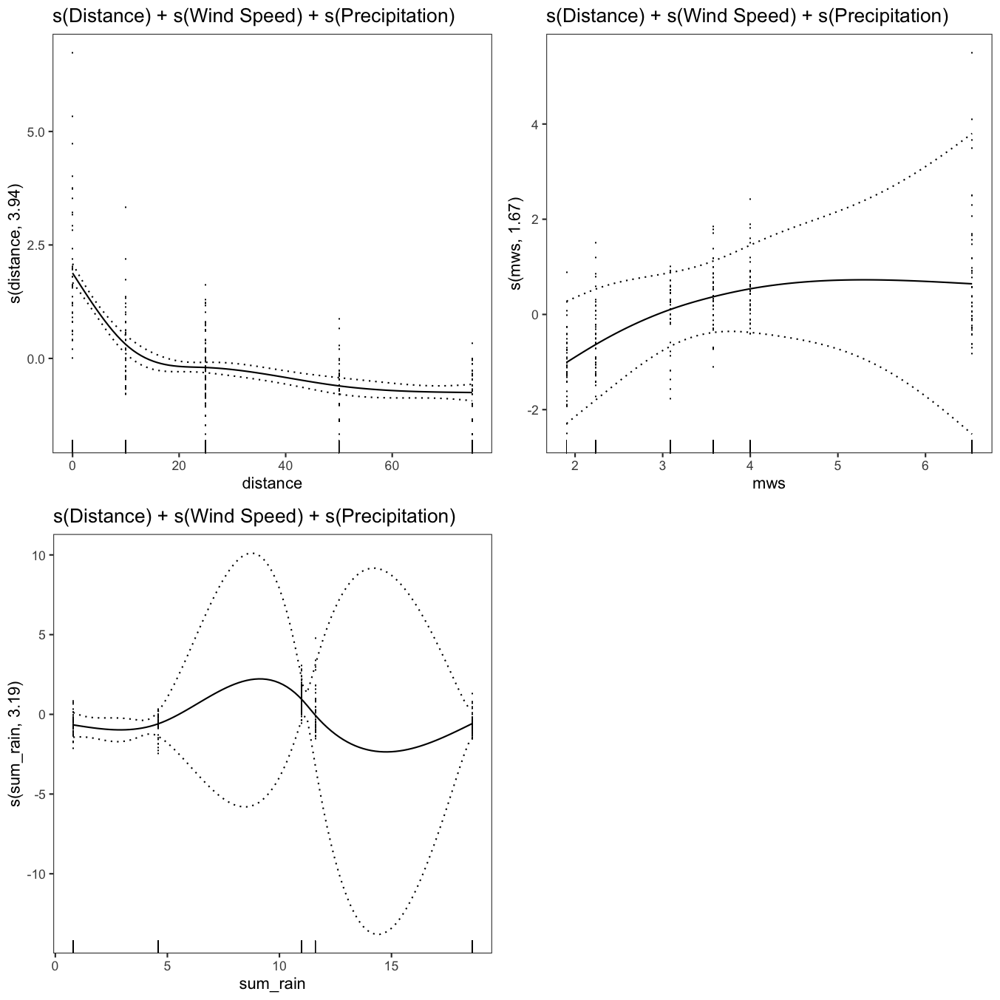
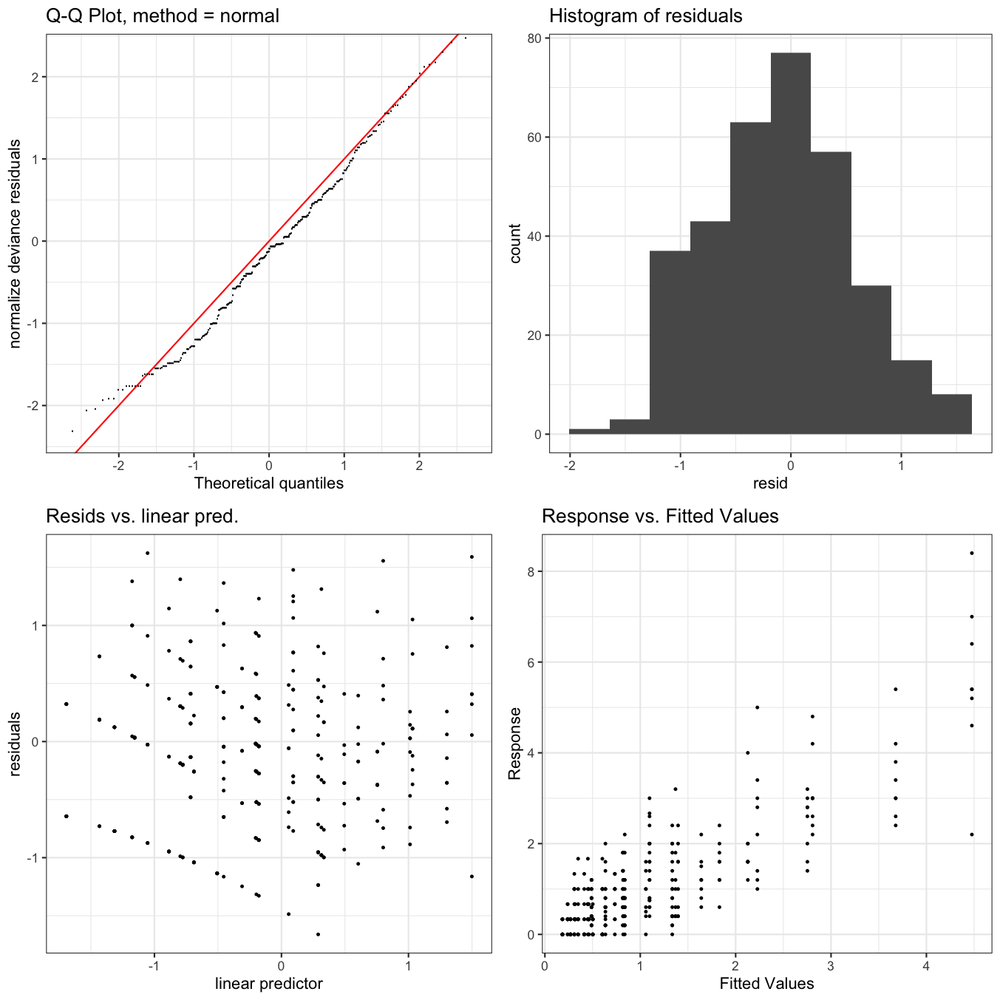

---
# Please do not edit this file directly; it is auto generated.
# Instead, please edit 16-fit_gam.md in _episodes_rmd/
title: "Fit and Compare Generalised Additive Models of Conidial Dispersal"
teaching: 45
exercises: 15
questions:
- "How can we use a generalised additive model (GAM) to represent conidial dispersal?"
- "What can the GAM tell us about the data?"
objectives:
- "Join different sets of data together for building a model."
- "Fit generalised additive models to data."
- "Determine which factors are necessary to include in the model."
- "Evaluate different models to determine which model provides the best fit."
- "Visualise a generalised additive model."
keypoints:
- "Generalised additive models are a powerful way to model non-linear relationships."
- "When fitting models to data, check many ways and compare."
- "There are no perfect models, only some that are better than others."
source: Rmd
---

In this episode we will explore how to fit and evaluate the best fitting model for our data.
I've chosen to use a generalised additive model for this work because as we saw in the data visualisation episode, the lesion count data is not linear, *i.e.* the lesion counts follow a curve not a straight line as you get farther from the source of inoculum.

### Load Libraries for This Exercise

Loading the `ChickpeaAscoDispersal` library will load the data we previously generated.

## Create Data Set for GAMs

Use `dplyr::left_join()` join the `lesion_counts` data and the `summary_weather` data to create `dat` for creating GAMs.
`left_join()` is a powerful tool for combining data sets based on one or more matching columns.

~~~
dat <-
   left_join(lesion_counts, summary_weather, by = c("site", "rep"))
~~~
{: .language-r}

## Fit GAMs

For reproducibility purposes, use `set.seed()`.

~~~
set.seed(27)
~~~
{: .language-r}

### mod1 - s(Distance)

~~~
mod1 <-
   gam(m_lesions ~ s(distance, k = 5),
       data = dat)

summary(mod1)
~~~
{: .language-r}

~~~

Family: gaussian 
Link function: identity 

Formula:
m_lesions ~ s(distance, k = 5)

Parametric coefficients:
            Estimate Std. Error t value            Pr(>|t|)    
(Intercept)   1.0802     0.0475    22.7 <0.0000000000000002 ***
---
Signif. codes:  0 '***' 0.001 '**' 0.01 '*' 0.05 '.' 0.1 ' ' 1

Approximate significance of smooth terms:
             edf Ref.df    F             p-value    
s(distance) 3.93      4 78.4 <0.0000000000000002 ***
---
Signif. codes:  0 '***' 0.001 '**' 0.01 '*' 0.05 '.' 0.1 ' ' 1

R-sq.(adj) =  0.482   Deviance explained = 48.8%
GCV = 0.76522  Scale est. = 0.75394   n = 334
~~~
{: .output}

~~~
print(p_gam(x = getViz(mod1)) +
         ggtitle("s(Distance)"),
      pages = 1)
~~~
{: .language-r}

~~~
mod1_vis <- getViz(mod1)
check(
   mod1_vis,
   a.qq = list(method = "tnorm",
               a.cipoly = list(fill = "light blue")),
   a.respoi = list(size = 0.5),
   a.hist = list(bins = 10)
)
~~~
{: .language-r}

~~~

Method: GCV   Optimizer: magic
Smoothing parameter selection converged after 9 iterations.
The RMS GCV score gradient at convergence was 0.00000156 .
The Hessian was positive definite.
Model rank =  5 / 5 

Basis dimension (k) checking results. Low p-value (k-index<1) may
indicate that k is too low, especially if edf is close to k'.

              k'  edf k-index             p-value    
s(distance) 4.00 3.93    0.57 <0.0000000000000002 ***
---
Signif. codes:  0 '***' 0.001 '**' 0.01 '*' 0.05 '.' 0.1 ' ' 1
~~~
{: .output}

### mod2 - s(Distance) + Precipitation

~~~
mod2 <-
   gam(m_lesions ~ sum_rain + s(distance, k = 5),
       data = dat)

summary(mod2)
~~~
{: .language-r}

~~~

Family: gaussian 
Link function: identity 

Formula:
m_lesions ~ sum_rain + s(distance, k = 5)

Parametric coefficients:
            Estimate Std. Error t value           Pr(>|t|)    
(Intercept)  0.77246    0.09247    8.35 0.0000000000000019 ***
sum_rain     0.03188    0.00828    3.85            0.00014 ***
---
Signif. codes:  0 '***' 0.001 '**' 0.01 '*' 0.05 '.' 0.1 ' ' 1

Approximate significance of smooth terms:
             edf Ref.df    F             p-value    
s(distance) 3.93      4 81.8 <0.0000000000000002 ***
---
Signif. codes:  0 '***' 0.001 '**' 0.01 '*' 0.05 '.' 0.1 ' ' 1

R-sq.(adj) =  0.502   Deviance explained =   51%
GCV = 0.7366  Scale est. = 0.72352   n = 334
~~~
{: .output}

~~~
print(p_gam(x = getViz(mod2)) +
         ggtitle("s(Distance) + Precipitation"),
      pages = 1)
~~~
{: .language-r}

~~~
mod2_vis <- getViz(mod2)
check(
   mod2_vis,
   a.qq = list(method = "tnorm",
               a.cipoly = list(fill = "light blue")),
   a.respoi = list(size = 0.5),
   a.hist = list(bins = 10)
)
~~~
{: .language-r}

~~~

Method: GCV   Optimizer: magic
Smoothing parameter selection converged after 9 iterations.
The RMS GCV score gradient at convergence was 0.000002464 .
The Hessian was positive definite.
Model rank =  6 / 6 

Basis dimension (k) checking results. Low p-value (k-index<1) may
indicate that k is too low, especially if edf is close to k'.

              k'  edf k-index             p-value    
s(distance) 4.00 3.93     0.6 <0.0000000000000002 ***
---
Signif. codes:  0 '***' 0.001 '**' 0.01 '*' 0.05 '.' 0.1 ' ' 1
~~~
{: .output}

### mod3 - s(Distance) + Wind speed

~~~
mod3 <-
   gam(m_lesions ~ mws + s(distance, k = 5),
       data = dat)

summary(mod3)
~~~
{: .language-r}

~~~

Family: gaussian 
Link function: identity 

Formula:
m_lesions ~ mws + s(distance, k = 5)

Parametric coefficients:
            Estimate Std. Error t value  Pr(>|t|)    
(Intercept)   0.6440     0.1182    5.45 0.0000001 ***
mws           0.1227     0.0306    4.01 0.0000747 ***
---
Signif. codes:  0 '***' 0.001 '**' 0.01 '*' 0.05 '.' 0.1 ' ' 1

Approximate significance of smooth terms:
             edf Ref.df  F             p-value    
s(distance) 3.93      4 82 <0.0000000000000002 ***
---
Signif. codes:  0 '***' 0.001 '**' 0.01 '*' 0.05 '.' 0.1 ' ' 1

R-sq.(adj) =  0.504   Deviance explained = 51.2%
GCV = 0.73389  Scale est. = 0.72086   n = 334
~~~
{: .output}

~~~
print(p_gam(x = getViz(mod3)) +
         ggtitle("s(Distance) + Wind speed"),
      pages = 1)
~~~
{: .language-r}

~~~
mod3_vis <- getViz(mod3)
check(
   mod3_vis,
   a.qq = list(method = "tnorm",
               a.cipoly = list(fill = "light blue")),
   a.respoi = list(size = 0.5),
   a.hist = list(bins = 10)
)
~~~
{: .language-r}

~~~

Method: GCV   Optimizer: magic
Smoothing parameter selection converged after 9 iterations.
The RMS GCV score gradient at convergence was 0.000001636 .
The Hessian was positive definite.
Model rank =  6 / 6 

Basis dimension (k) checking results. Low p-value (k-index<1) may
indicate that k is too low, especially if edf is close to k'.

              k'  edf k-index             p-value    
s(distance) 4.00 3.93    0.58 <0.0000000000000002 ***
---
Signif. codes:  0 '***' 0.001 '**' 0.01 '*' 0.05 '.' 0.1 ' ' 1
~~~
{: .output}

### mod4 - s(Distance) + Wind speed + Precipitation

~~~
mod4 <-
   gam(m_lesions ~ sum_rain + mws + s(distance, k = 5),
       data = dat)

summary(mod4)
~~~
{: .language-r}

~~~

Family: gaussian 
Link function: identity 

Formula:
m_lesions ~ sum_rain + mws + s(distance, k = 5)

Parametric coefficients:
            Estimate Std. Error t value Pr(>|t|)    
(Intercept)  0.43568    0.13226    3.29  0.00110 ** 
sum_rain     0.02739    0.00824    3.32  0.00099 ***
mws          0.10696    0.03051    3.51  0.00052 ***
---
Signif. codes:  0 '***' 0.001 '**' 0.01 '*' 0.05 '.' 0.1 ' ' 1

Approximate significance of smooth terms:
             edf Ref.df    F             p-value    
s(distance) 3.93      4 84.6 <0.0000000000000002 ***
---
Signif. codes:  0 '***' 0.001 '**' 0.01 '*' 0.05 '.' 0.1 ' ' 1

R-sq.(adj) =  0.519   Deviance explained = 52.8%
GCV = 0.71426  Scale est. = 0.69944   n = 334
~~~
{: .output}

~~~
print(p_gam(x = getViz(mod4)) +
         ggtitle("s(Distance) + Wind speed + Precipitation"),
      pages = 1)
~~~
{: .language-r}

~~~
mod4_vis <- getViz(mod4)
check(
   mod4_vis,
   a.qq = list(method = "tnorm",
               a.cipoly = list(fill = "light blue")),
   a.respoi = list(size = 0.5),
   a.hist = list(bins = 10)
)
~~~
{: .language-r}

~~~

Method: GCV   Optimizer: magic
Smoothing parameter selection converged after 9 iterations.
The RMS GCV score gradient at convergence was 0.000002433 .
The Hessian was positive definite.
Model rank =  7 / 7 

Basis dimension (k) checking results. Low p-value (k-index<1) may
indicate that k is too low, especially if edf is close to k'.

              k'  edf k-index             p-value    
s(distance) 4.00 3.93     0.6 <0.0000000000000002 ***
---
Signif. codes:  0 '***' 0.001 '**' 0.01 '*' 0.05 '.' 0.1 ' ' 1
~~~
{: .output}

### mod5 - s(Distance + Wind Speed) + Precipitation

~~~
mod5 <-
   gam(m_lesions ~ sum_rain + s(distance + mws, k = 5),
       data = dat)
~~~
{: .language-r}

~~~
Warning in term[i] <- attr(terms(reformulate(term[i])), "term.labels"): number
of items to replace is not a multiple of replacement length
~~~
{: .warning}

~~~
summary(mod5)
~~~
{: .language-r}

~~~

Family: gaussian 
Link function: identity 

Formula:
m_lesions ~ sum_rain + s(distance + mws, k = 5)

Parametric coefficients:
            Estimate Std. Error t value           Pr(>|t|)    
(Intercept)  0.77246    0.09247    8.35 0.0000000000000019 ***
sum_rain     0.03188    0.00828    3.85            0.00014 ***
---
Signif. codes:  0 '***' 0.001 '**' 0.01 '*' 0.05 '.' 0.1 ' ' 1

Approximate significance of smooth terms:
             edf Ref.df    F             p-value    
s(distance) 3.93      4 81.8 <0.0000000000000002 ***
---
Signif. codes:  0 '***' 0.001 '**' 0.01 '*' 0.05 '.' 0.1 ' ' 1

R-sq.(adj) =  0.502   Deviance explained =   51%
GCV = 0.7366  Scale est. = 0.72352   n = 334
~~~
{: .output}

~~~
print(p_gam(x = getViz(mod5)) +
         ggtitle("s(Distance + Wind Speed) + Precipitation"),
      pages = 1)
~~~
{: .language-r}

~~~
mod5_vis <- getViz(mod5)
check(
   mod5_vis,
   a.qq = list(method = "tnorm",
               a.cipoly = list(fill = "light blue")),
   a.respoi = list(size = 0.5),
   a.hist = list(bins = 10)
)
~~~
{: .language-r}

~~~

Method: GCV   Optimizer: magic
Smoothing parameter selection converged after 9 iterations.
The RMS GCV score gradient at convergence was 0.000002464 .
The Hessian was positive definite.
Model rank =  6 / 6 

Basis dimension (k) checking results. Low p-value (k-index<1) may
indicate that k is too low, especially if edf is close to k'.

              k'  edf k-index             p-value    
s(distance) 4.00 3.93     0.6 <0.0000000000000002 ***
---
Signif. codes:  0 '***' 0.001 '**' 0.01 '*' 0.05 '.' 0.1 ' ' 1
~~~
{: .output}

### mod6 - s(Distance) + s(Wind Speed) + Precipitation

~~~
mod6 <-
   gam(m_lesions ~ sum_rain + s(distance, k = 5) + s(mws, k = 5),
       data = dat)

summary(mod6)
~~~
{: .language-r}

~~~

Family: gaussian 
Link function: identity 

Formula:
m_lesions ~ sum_rain + s(distance, k = 5) + s(mws, k = 5)

Parametric coefficients:
            Estimate Std. Error t value          Pr(>|t|)    
(Intercept)   1.4035     0.1800    7.80 0.000000000000088 ***
sum_rain     -0.0335     0.0181   -1.85             0.065 .  
---
Signif. codes:  0 '***' 0.001 '**' 0.01 '*' 0.05 '.' 0.1 ' ' 1

Approximate significance of smooth terms:
             edf Ref.df    F              p-value    
s(distance) 3.94      4 93.8 < 0.0000000000000002 ***
s(mws)      3.93      4 12.7        0.00000000099 ***
---
Signif. codes:  0 '***' 0.001 '**' 0.01 '*' 0.05 '.' 0.1 ' ' 1

R-sq.(adj) =  0.566   Deviance explained = 57.8%
GCV = 0.6497  Scale est. = 0.63051   n = 334
~~~
{: .output}

~~~
print(p_gam(x = getViz(mod6)) +
         ggtitle("s(Distance) + s(Wind Speed) + Precipitation"),
      pages = 1)
~~~
{: .language-r}

~~~
mod6_vis <- getViz(mod6)
check(
   mod6_vis,
   a.qq = list(method = "tnorm",
               a.cipoly = list(fill = "light blue")),
   a.respoi = list(size = 0.5),
   a.hist = list(bins = 10)
)
~~~
{: .language-r}

~~~

Method: GCV   Optimizer: magic
Smoothing parameter selection converged after 13 iterations.
The RMS GCV score gradient at convergence was 0.000005952 .
The Hessian was positive definite.
Model rank =  10 / 10 

Basis dimension (k) checking results. Low p-value (k-index<1) may
indicate that k is too low, especially if edf is close to k'.

              k'  edf k-index             p-value    
s(distance) 4.00 3.94    0.68 <0.0000000000000002 ***
s(mws)      4.00 3.93    0.85 <0.0000000000000002 ***
---
Signif. codes:  0 '***' 0.001 '**' 0.01 '*' 0.05 '.' 0.1 ' ' 1
~~~
{: .output}

### mod7 - s(Distance) + s(Wind Speed)

~~~
mod7 <-
   gam(m_lesions ~ s(distance, k = 5) + s(mws, k = 5),
       data = dat)

summary(mod7)
~~~
{: .language-r}

~~~

Family: gaussian 
Link function: identity 

Formula:
m_lesions ~ s(distance, k = 5) + s(mws, k = 5)

Parametric coefficients:
            Estimate Std. Error t value            Pr(>|t|)    
(Intercept)   1.0802     0.0437    24.7 <0.0000000000000002 ***
---
Signif. codes:  0 '***' 0.001 '**' 0.01 '*' 0.05 '.' 0.1 ' ' 1

Approximate significance of smooth terms:
             edf Ref.df  F              p-value    
s(distance) 3.94   4.00 93 < 0.0000000000000002 ***
s(mws)      3.92   3.99 16       0.000000000006 ***
---
Signif. codes:  0 '***' 0.001 '**' 0.01 '*' 0.05 '.' 0.1 ' ' 1

R-sq.(adj) =  0.562   Deviance explained = 57.3%
GCV = 0.65392  Scale est. = 0.63659   n = 334
~~~
{: .output}

~~~
print(p_gam(x = getViz(mod7)) +
         ggtitle("s(Distance) + s(Wind Speed)"),
      pages = 1)
~~~
{: .language-r}

~~~
mod7_vis <- getViz(mod7)
check(
   mod7_vis,
   a.qq = list(method = "tnorm",
               a.cipoly = list(fill = "light blue")),
   a.respoi = list(size = 0.5),
   a.hist = list(bins = 10)
)
~~~
{: .language-r}

~~~

Method: GCV   Optimizer: magic
Smoothing parameter selection converged after 10 iterations.
The RMS GCV score gradient at convergence was 0.000004043 .
The Hessian was positive definite.
Model rank =  9 / 9 

Basis dimension (k) checking results. Low p-value (k-index<1) may
indicate that k is too low, especially if edf is close to k'.

              k'  edf k-index             p-value    
s(distance) 4.00 3.94    0.67 <0.0000000000000002 ***
s(mws)      4.00 3.92    0.84 <0.0000000000000002 ***
---
Signif. codes:  0 '***' 0.001 '**' 0.01 '*' 0.05 '.' 0.1 ' ' 1
~~~
{: .output}

### mod8 - s(Distance) + s(Wind Speed) + s(Precipitation)

~~~
mod8 <-
   gam(m_lesions ~ s(distance, k = 5) + s(mws, k = 5) + s(sum_rain, k = 5),
       data = dat)

summary(mod8)
~~~
{: .language-r}

~~~

Family: gaussian 
Link function: identity 

Formula:
m_lesions ~ s(distance, k = 5) + s(mws, k = 5) + s(sum_rain, 
    k = 5)

Parametric coefficients:
            Estimate Std. Error t value            Pr(>|t|)    
(Intercept)   1.0802     0.0434    24.9 <0.0000000000000002 ***
---
Signif. codes:  0 '***' 0.001 '**' 0.01 '*' 0.05 '.' 0.1 ' ' 1

Approximate significance of smooth terms:
             edf Ref.df     F             p-value    
s(distance) 3.94   4.00 93.80 <0.0000000000000002 ***
s(mws)      1.67   1.76  1.36               0.333    
s(sum_rain) 3.19   3.22  3.30               0.011 *  
---
Signif. codes:  0 '***' 0.001 '**' 0.01 '*' 0.05 '.' 0.1 ' ' 1

R-sq.(adj) =  0.566   Deviance explained = 57.8%
GCV = 0.64956  Scale est. = 0.63051   n = 334
~~~
{: .output}

~~~
print(p_gam(x = getViz(mod8)) +
         ggtitle("s(Distance) + s(Wind Speed) + s(Precipitation)"),
      pages = 1)
~~~
{: .language-r}

~~~
mod8_vis <- getViz(mod8)
check(
   mod8_vis,
   a.qq = list(method = "tnorm",
               a.cipoly = list(fill = "light blue")),
   a.respoi = list(size = 0.5),
   a.hist = list(bins = 10)
)
~~~
{: .language-r}

~~~

Method: GCV   Optimizer: magic
Smoothing parameter selection converged after 22 iterations.
The RMS GCV score gradient at convergence was 0.0000006903 .
The Hessian was positive definite.
Model rank =  13 / 13 

Basis dimension (k) checking results. Low p-value (k-index<1) may
indicate that k is too low, especially if edf is close to k'.

              k'  edf k-index             p-value    
s(distance) 4.00 3.94    0.68 <0.0000000000000002 ***
s(mws)      4.00 1.67    0.85 <0.0000000000000002 ***
s(sum_rain) 4.00 3.19    0.88                0.01 ** 
---
Signif. codes:  0 '***' 0.001 '**' 0.01 '*' 0.05 '.' 0.1 ' ' 1
~~~
{: .output}

### mod9 - s(Distance) + s(Precipitation)

~~~
mod9 <-
   gam(m_lesions ~ s(distance, k = 5) + s(sum_rain, k = 5),
       data = dat)

summary(mod9)
~~~
{: .language-r}

~~~

Family: gaussian 
Link function: identity 

Formula:
m_lesions ~ s(distance, k = 5) + s(sum_rain, k = 5)

Parametric coefficients:
            Estimate Std. Error t value            Pr(>|t|)    
(Intercept)   1.0802     0.0439    24.6 <0.0000000000000002 ***
---
Signif. codes:  0 '***' 0.001 '**' 0.01 '*' 0.05 '.' 0.1 ' ' 1

Approximate significance of smooth terms:
             edf Ref.df    F              p-value    
s(distance) 3.94   4.00 91.8 < 0.0000000000000002 ***
s(sum_rain) 3.90   3.99 15.2       0.000000000054 ***
---
Signif. codes:  0 '***' 0.001 '**' 0.01 '*' 0.05 '.' 0.1 ' ' 1

R-sq.(adj) =  0.557   Deviance explained = 56.7%
GCV = 0.66195  Scale est. = 0.64444   n = 334
~~~
{: .output}

~~~
print(p_gam(x = getViz(mod9)) +
         ggtitle("s(Distance) + s(Precipitation)"),
      pages = 1)
~~~
{: .language-r}

~~~
mod9_vis <- getViz(mod9)
check(
   mod9_vis,
   a.qq = list(method = "tnorm",
               a.cipoly = list(fill = "light blue")),
   a.respoi = list(size = 0.5),
   a.hist = list(bins = 10)
)
~~~
{: .language-r}

~~~

Method: GCV   Optimizer: magic
Smoothing parameter selection converged after 14 iterations.
The RMS GCV score gradient at convergence was 0.000003891 .
The Hessian was positive definite.
Model rank =  9 / 9 

Basis dimension (k) checking results. Low p-value (k-index<1) may
indicate that k is too low, especially if edf is close to k'.

              k'  edf k-index             p-value    
s(distance) 4.00 3.94    0.66 <0.0000000000000002 ***
s(sum_rain) 4.00 3.90    0.86 <0.0000000000000002 ***
---
Signif. codes:  0 '***' 0.001 '**' 0.01 '*' 0.05 '.' 0.1 ' ' 1
~~~
{: .output}

### mod10 - s(Distance) +s(Precipitation) + Wind speed

~~~
mod10 <-
   gam(m_lesions ~ s(distance, k = 5) + s(sum_rain, k = 5) + mws,
       data = dat)

summary(mod10)
~~~
{: .language-r}

~~~

Family: gaussian 
Link function: identity 

Formula:
m_lesions ~ s(distance, k = 5) + s(sum_rain, k = 5) + mws

Parametric coefficients:
            Estimate Std. Error t value Pr(>|t|)  
(Intercept)   -2.536      1.414   -1.79    0.074 .
mws            1.017      0.398    2.56    0.011 *
---
Signif. codes:  0 '***' 0.001 '**' 0.01 '*' 0.05 '.' 0.1 ' ' 1

Approximate significance of smooth terms:
             edf Ref.df    F              p-value    
s(distance) 3.94   4.00 93.8 < 0.0000000000000002 ***
s(sum_rain) 3.76   3.94 13.7          0.000000015 ***
---
Signif. codes:  0 '***' 0.001 '**' 0.01 '*' 0.05 '.' 0.1 ' ' 1

R-sq.(adj) =  0.566   Deviance explained = 57.8%
GCV = 0.64968  Scale est. = 0.63081   n = 334
~~~
{: .output}

~~~
print(p_gam(x = getViz(mod10)) +
         ggtitle("s(Distance) + s(Precipitation) + Wind speed"),
      pages = 1)
~~~
{: .language-r}

~~~
mod10_vis <- getViz(mod10)
check(
   mod10_vis,
   a.qq = list(method = "tnorm",
               a.cipoly = list(fill = "light blue")),
   a.respoi = list(size = 0.5),
   a.hist = list(bins = 10)
)
~~~
{: .language-r}

~~~

Method: GCV   Optimizer: magic
Smoothing parameter selection converged after 10 iterations.
The RMS GCV score gradient at convergence was 0.000002722 .
The Hessian was positive definite.
Model rank =  10 / 10 

Basis dimension (k) checking results. Low p-value (k-index<1) may
indicate that k is too low, especially if edf is close to k'.

              k'  edf k-index             p-value    
s(distance) 4.00 3.94    0.68 <0.0000000000000002 ***
s(sum_rain) 4.00 3.76    0.88 <0.0000000000000002 ***
---
Signif. codes:  0 '***' 0.001 '**' 0.01 '*' 0.05 '.' 0.1 ' ' 1
~~~
{: .output}

### mod11 - s(Distance) + s(Wind Speed) + s(Precipitation), family = tw()

This is the same as `mod8` but using `family = tw()`, see `?family.mgcv` for more on the families.
The Tweedie distribution is used where the distribution has a positive mass at zero, but is continuous unlike the Poisson distribution that requires count data.
The data visualisation shows clearly that the mean pot count data have this shape.

~~~
mod11 <-
   gam(
      m_lesions ~ s(distance, k = 5) +
         s(mws, k = 5) +
         s(sum_rain, k = 5),
      data = dat,
      family = tw()
   )

summary(mod11)
~~~
{: .language-r}

~~~

Family: Tweedie(p=1.044) 
Link function: log 

Formula:
m_lesions ~ s(distance, k = 5) + s(mws, k = 5) + s(sum_rain, 
    k = 5)

Parametric coefficients:
            Estimate Std. Error t value    Pr(>|t|)    
(Intercept)   -0.228      0.041   -5.57 0.000000054 ***
---
Signif. codes:  0 '***' 0.001 '**' 0.01 '*' 0.05 '.' 0.1 ' ' 1

Approximate significance of smooth terms:
             edf Ref.df      F             p-value    
s(distance) 3.50   3.85 123.78 <0.0000000000000002 ***
s(mws)      1.99   2.09   0.82              0.4506    
s(sum_rain) 2.81   2.88   5.49              0.0016 ** 
---
Signif. codes:  0 '***' 0.001 '**' 0.01 '*' 0.05 '.' 0.1 ' ' 1

R-sq.(adj) =  0.674   Deviance explained = 61.2%
-REML = 309.96  Scale est. = 0.36397   n = 334
~~~
{: .output}

~~~
print(
   p_gam(x = getViz(mod11)) +
      ggtitle("s(Distance) + s(Wind Speed) + s(Precipitation), family = tw()"),
   pages = 1
)
~~~
{: .language-r}

~~~
mod11_vis <- getViz(mod11)
check(
   mod11_vis,
   a.qq = list(method = "tnorm",
               a.cipoly = list(fill = "light blue")),
   a.respoi = list(size = 0.5),
   a.hist = list(bins = 10)
)
~~~
{: .language-r}

~~~

Method: REML   Optimizer: outer newton
full convergence after 8 iterations.
Gradient range [-0.0000004289,0.0000002611]
(score 310 & scale 0.364).
Hessian positive definite, eigenvalue range [0.3685,2979].
Model rank =  13 / 13 

Basis dimension (k) checking results. Low p-value (k-index<1) may
indicate that k is too low, especially if edf is close to k'.

              k'  edf k-index p-value   
s(distance) 4.00 3.50    0.87   0.005 **
s(mws)      4.00 1.99    0.98   0.550   
s(sum_rain) 4.00 2.81    1.00   0.660   
---
Signif. codes:  0 '***' 0.001 '**' 0.01 '*' 0.05 '.' 0.1 ' ' 1
~~~
{: .output}

### mod12 - s(Distance, bs = "ts") + s(Precipitation, bs = "ts") Wind speed, family = tw()

Try using wind speed as a linear predictor only.

~~~
mod12 <-
   gam(
      m_lesions ~ s(distance, k = 5, bs = "ts") +
         s(mws, k = 5, bs = "ts") +
         s(sum_rain, k = 5, bs = "ts"),
      data = dat,
      family = tw()
   )

summary(mod12)
~~~
{: .language-r}

~~~

Family: Tweedie(p=1.044) 
Link function: log 

Formula:
m_lesions ~ s(distance, k = 5, bs = "ts") + s(mws, k = 5, bs = "ts") + 
    s(sum_rain, k = 5, bs = "ts")

Parametric coefficients:
            Estimate Std. Error t value   Pr(>|t|)    
(Intercept)  -0.2220     0.0409   -5.43 0.00000011 ***
---
Signif. codes:  0 '***' 0.001 '**' 0.01 '*' 0.05 '.' 0.1 ' ' 1

Approximate significance of smooth terms:
              edf Ref.df     F              p-value    
s(distance) 3.248      4 117.7 < 0.0000000000000002 ***
s(mws)      0.909      4   2.4              0.00027 ***
s(sum_rain) 2.864      4  15.8     0.00000000000023 ***
---
Signif. codes:  0 '***' 0.001 '**' 0.01 '*' 0.05 '.' 0.1 ' ' 1

R-sq.(adj) =  0.657   Deviance explained =   60%
-REML = 319.36  Scale est. = 0.36504   n = 334
~~~
{: .output}

~~~
print(
   p_gam(x = getViz(mod12)) +
      ggtitle(
         "s(Distance, bs = 'ts') + s(Wind speed, bs = 'ts')\n+ s(Precipitation, bs = 'ts'), family = tw()"
      ),
   pages = 1
)
~~~
{: .language-r}

~~~
mod12_vis <- getViz(mod12)
check(
   mod12_vis,
   a.qq = list(method = "tnorm",
               a.cipoly = list(fill = "light blue")),
   a.respoi = list(size = 0.5),
   a.hist = list(bins = 10)
)
~~~
{: .language-r}

~~~

Method: REML   Optimizer: outer newton
full convergence after 10 iterations.
Gradient range [-0.0000002559,0.0000001837]
(score 319.4 & scale 0.365).
Hessian positive definite, eigenvalue range [0.4025,2979].
Model rank =  13 / 13 

Basis dimension (k) checking results. Low p-value (k-index<1) may
indicate that k is too low, especially if edf is close to k'.

               k'   edf k-index             p-value    
s(distance) 4.000 3.248    0.84 <0.0000000000000002 ***
s(mws)      4.000 0.909    0.96                0.35    
s(sum_rain) 4.000 2.864    0.98                0.49    
---
Signif. codes:  0 '***' 0.001 '**' 0.01 '*' 0.05 '.' 0.1 ' ' 1
~~~
{: .output}

### mod13 - s(Distance, bs = "ts") + s(Wind speed, bs = "ts") + s(Precipitation, bs = "ts"), family = tw()

~~~
mod13 <-
   gam(
      m_lesions ~ s(distance, k = 5, bs = "ts") +
         s(mws, k = 5, bs = "ts") +
         s(sum_rain, k = 5, bs = "ts"),
      data = dat,
      family = tw()
   )

summary(mod13)
~~~
{: .language-r}

~~~

Family: Tweedie(p=1.044) 
Link function: log 

Formula:
m_lesions ~ s(distance, k = 5, bs = "ts") + s(mws, k = 5, bs = "ts") + 
    s(sum_rain, k = 5, bs = "ts")

Parametric coefficients:
            Estimate Std. Error t value   Pr(>|t|)    
(Intercept)  -0.2220     0.0409   -5.43 0.00000011 ***
---
Signif. codes:  0 '***' 0.001 '**' 0.01 '*' 0.05 '.' 0.1 ' ' 1

Approximate significance of smooth terms:
              edf Ref.df     F              p-value    
s(distance) 3.248      4 117.7 < 0.0000000000000002 ***
s(mws)      0.909      4   2.4              0.00027 ***
s(sum_rain) 2.864      4  15.8     0.00000000000023 ***
---
Signif. codes:  0 '***' 0.001 '**' 0.01 '*' 0.05 '.' 0.1 ' ' 1

R-sq.(adj) =  0.657   Deviance explained =   60%
-REML = 319.36  Scale est. = 0.36504   n = 334
~~~
{: .output}

~~~
print(
   p_gam(x = getViz(mod13)) +
      ggtitle(
         "s(Distance, bs = 'ts') + s(Wind speed, bs = 'ts')\n+ s(Precipitation, bs = 'ts'), family = tw()"
      ),
   pages = 1
)
~~~
{: .language-r}

~~~
mod13_vis <- getViz(mod13)
check(
   mod13_vis,
   a.qq = list(method = "tnorm",
               a.cipoly = list(fill = "light blue")),
   a.respoi = list(size = 0.5),
   a.hist = list(bins = 10)
)
~~~
{: .language-r}

~~~

Method: REML   Optimizer: outer newton
full convergence after 10 iterations.
Gradient range [-0.0000002559,0.0000001837]
(score 319.4 & scale 0.365).
Hessian positive definite, eigenvalue range [0.4025,2979].
Model rank =  13 / 13 

Basis dimension (k) checking results. Low p-value (k-index<1) may
indicate that k is too low, especially if edf is close to k'.

               k'   edf k-index             p-value    
s(distance) 4.000 3.248    0.84 <0.0000000000000002 ***
s(mws)      4.000 0.909    0.96                0.34    
s(sum_rain) 4.000 2.864    0.98                0.48    
---
Signif. codes:  0 '***' 0.001 '**' 0.01 '*' 0.05 '.' 0.1 ' ' 1
~~~
{: .output}

This model, same structure as `mod11`, uses thin-plate splines to shrink the coefficients of the smooth to zero when possible.

## Compare the Models

### AIC, BIC

~~~
models <- list(
   mod1 = mod1,
   mod2 = mod2,
   mod3 = mod3,
   mod4 = mod4,
   mod5 = mod5,
   mod6 = mod6,
   mod7 = mod7,
   mod8 = mod8,
   mod9 = mod9,
   mod10 = mod10,
   mod11 = mod11,
   mod12 = mod12,
   mod13 = mod13
)
map_df(models, glance, .id = "model") %>%
   arrange(AIC)
~~~
{: .language-r}

~~~
# A tibble: 13 x 8
   model    df logLik   AIC   BIC deviance df.residual  nobs
   <chr> <dbl>  <dbl> <dbl> <dbl>    <dbl>       <dbl> <int>
 1 mod11  9.30  -320.  663.  709.     141.        325.   334
 2 mod12  8.02  -334.  689.  729.     145.        326.   334
 3 mod13  8.02  -334.  689.  729.     145.        326.   334
 4 mod8   9.80  -392.  805.  847.     204.        324.   334
 5 mod10  9.70  -392.  806.  846.     205.        324.   334
 6 mod6   9.86  -392.  806.  847.     204.        324.   334
 7 mod7   8.85  -394.  808.  845.     207.        325.   334
 8 mod9   8.84  -396.  812.  849.     210.        325.   334
 9 mod4   6.93  -411.  837.  868.     229.        327.   334
10 mod3   5.93  -416.  846.  873.     236.        328.   334
11 mod2   5.93  -417.  848.  874.     237.        328.   334
12 mod5   5.93  -417.  848.  874.     237.        328.   334
13 mod1   4.93  -424.  860.  883.     248.        329.   334
~~~
{: .output}

### R^2^

~~~
enframe(
   c(
      mod1 = summary(mod1)$r.sq,
      mod2 = summary(mod2)$r.sq,
      mod3 = summary(mod3)$r.sq,
      mod4 = summary(mod4)$r.sq,
      mod5 = summary(mod5)$r.sq,
      mod6 = summary(mod6)$r.sq,
      mod7 = summary(mod7)$r.sq,
      mod8 = summary(mod8)$r.sq,
      mod9 = summary(mod9)$r.sq,
      mod10 = summary(mod10)$r.sq,
      mod11 = summary(mod11)$r.sq,
      mod12 = summary(mod12)$r.sq,
      mod13 = summary(mod13)$r.sq
   )
) %>%
   arrange(desc(value))
~~~
{: .language-r}

~~~
# A tibble: 13 x 2
   name  value
   <chr> <dbl>
 1 mod11 0.674
 2 mod12 0.657
 3 mod13 0.657
 4 mod8  0.566
 5 mod6  0.566
 6 mod10 0.566
 7 mod7  0.562
 8 mod9  0.557
 9 mod4  0.519
10 mod3  0.504
11 mod2  0.502
12 mod5  0.502
13 mod1  0.482
~~~
{: .output}

### ANOVA

~~~
anova(mod1,
      mod2,
      mod3,
      mod4,
      mod5,
      mod6,
      mod7,
      mod8,
      mod9,
      mod10,
      mod11,
      mod12,
      mod13,
      test = "F")
~~~
{: .language-r}

~~~
Analysis of Deviance Table

Model  1: m_lesions ~ s(distance, k = 5)
Model  2: m_lesions ~ sum_rain + s(distance, k = 5)
Model  3: m_lesions ~ mws + s(distance, k = 5)
Model  4: m_lesions ~ sum_rain + mws + s(distance, k = 5)
Model  5: m_lesions ~ sum_rain + s(distance + mws, k = 5)
Model  6: m_lesions ~ sum_rain + s(distance, k = 5) + s(mws, k = 5)
Model  7: m_lesions ~ s(distance, k = 5) + s(mws, k = 5)
Model  8: m_lesions ~ s(distance, k = 5) + s(mws, k = 5) + s(sum_rain, 
    k = 5)
Model  9: m_lesions ~ s(distance, k = 5) + s(sum_rain, k = 5)
Model 10: m_lesions ~ s(distance, k = 5) + s(sum_rain, k = 5) + mws
Model 11: m_lesions ~ s(distance, k = 5) + s(mws, k = 5) + s(sum_rain, 
    k = 5)
Model 12: m_lesions ~ s(distance, k = 5, bs = "ts") + s(mws, k = 5, bs = "ts") + 
    s(sum_rain, k = 5, bs = "ts")
Model 13: m_lesions ~ s(distance, k = 5, bs = "ts") + s(mws, k = 5, bs = "ts") + 
    s(sum_rain, k = 5, bs = "ts")
   Resid. Df Resid. Dev        Df Deviance        F               Pr(>F)    
1        329        248                                                     
2        328        237  1.000267       11    29.48           0.00000011 ***
3        328        236  0.000102        1 23517.82           0.00000819 ***
4        327        229  1.000171        8    21.23           0.00000586 ***
5        328        237 -1.000273       -9    23.63           0.00000182 ***
6        324        204  3.996433       33    22.68 < 0.0000000000000002 ***
7        325        207 -1.000793       -3     7.17              0.00777 ** 
8        324        204  0.985070        3     7.17              0.00806 ** 
9        325        210 -0.989250       -5    14.26              0.00020 ***
10       324        205  0.953818        5    14.34              0.00023 ***
11       324        640  0.410085     -435                                  
12       325        667 -1.025206      -28    73.96 < 0.0000000000000002 ***
13       325        667  0.000000        0                                  
---
Signif. codes:  0 '***' 0.001 '**' 0.01 '*' 0.05 '.' 0.1 ' ' 1
~~~
{: .output}

> ## Challenge 1
>
> Discuss with your neighbours which model is the best fit and why.
>
> What are the criteria that you've used to determine this?
>
> What can you say about the model?
> 
> What can you NOT say about the model?
>
> > ## Solution to Challenge 1
> >This model, _mod11_,
> > `m_lesions ~ s(Distance) + s(WindSpeed) + s(Precipitation) - family = tw()`,
> >is the best performing model.
> >
> >*It cannot be used for predictions*, but it suitably describes the dispersal
> >data we have on hand with the parameters used.
> >
> >More data would be desirable to increase the value of `k` as evidenced in the
> >GAM checks.
> >
> {: .solution}
{: .challenge}
