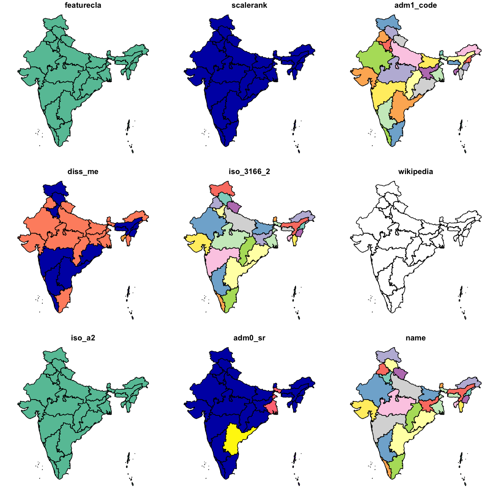
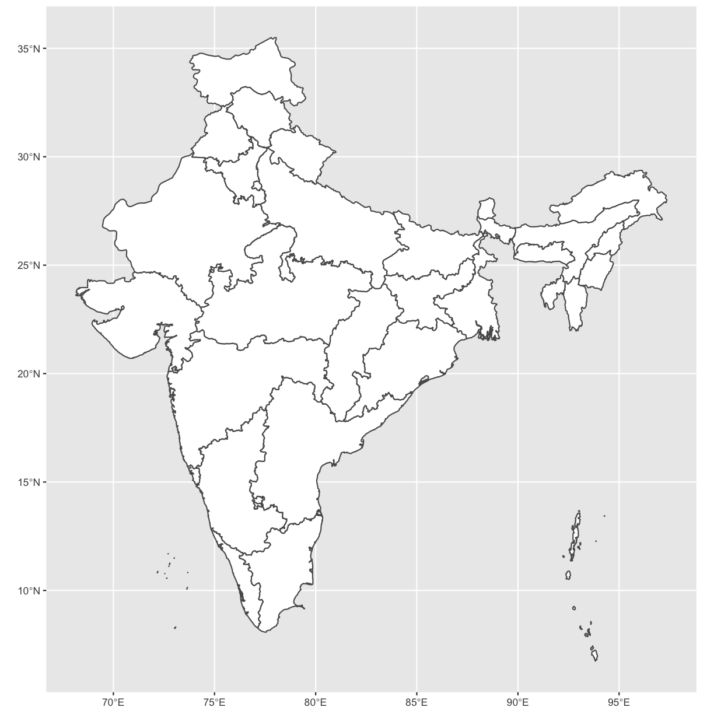
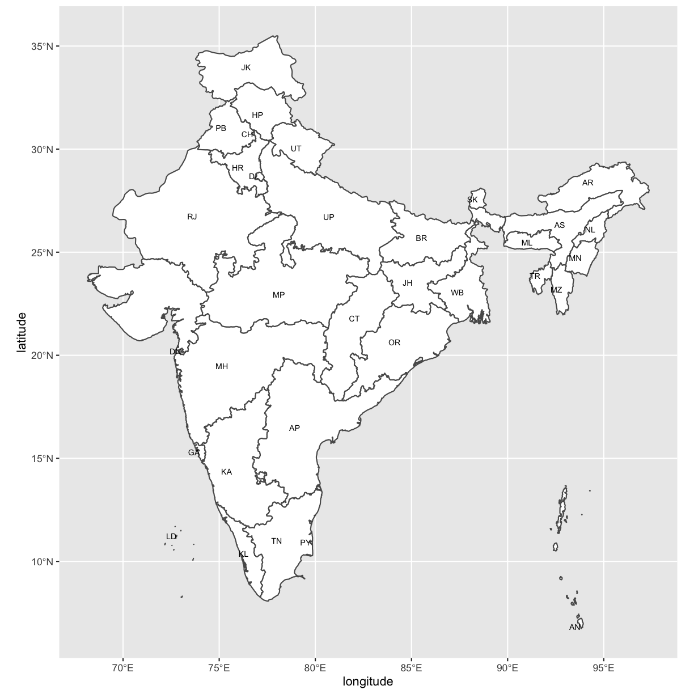
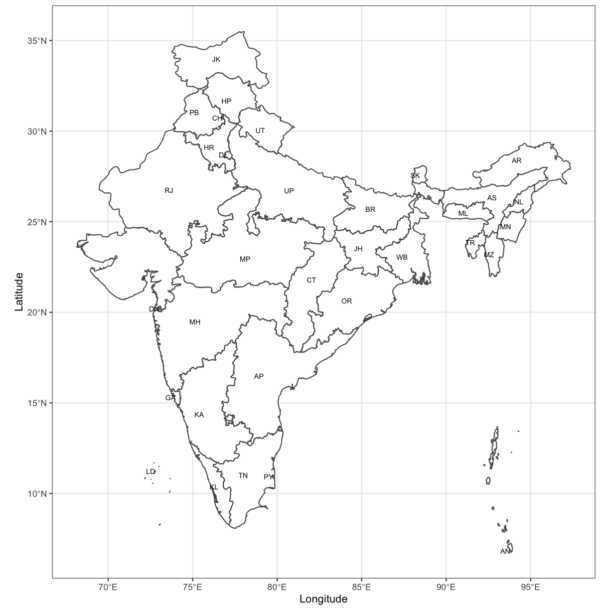
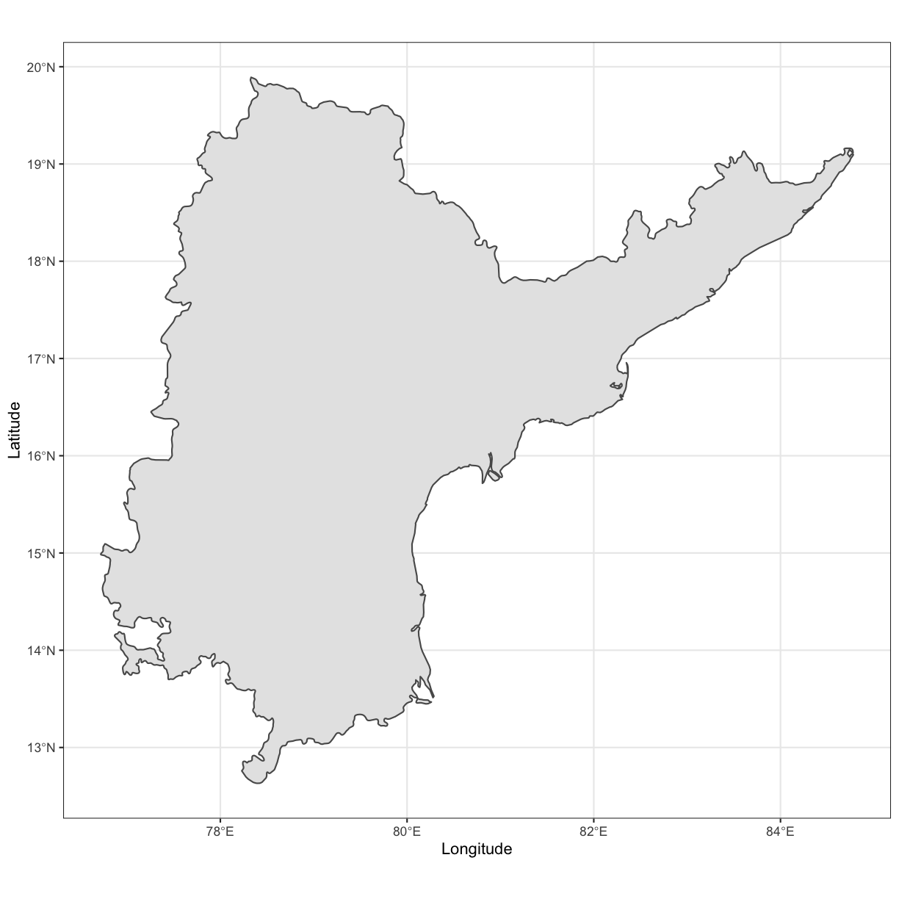
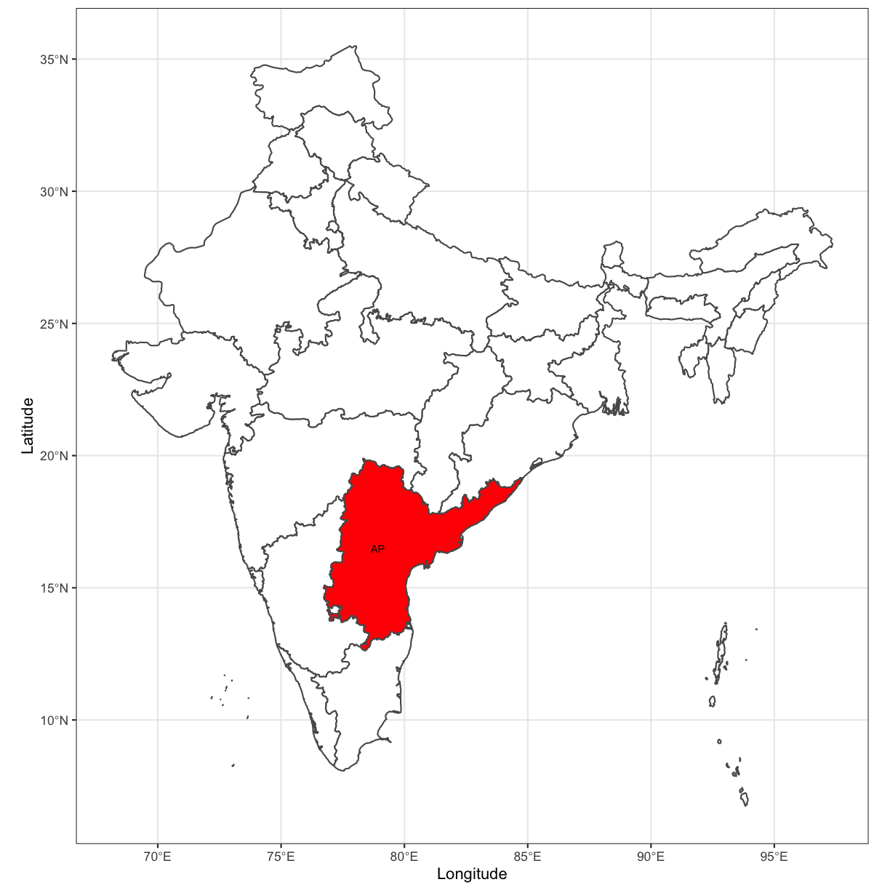
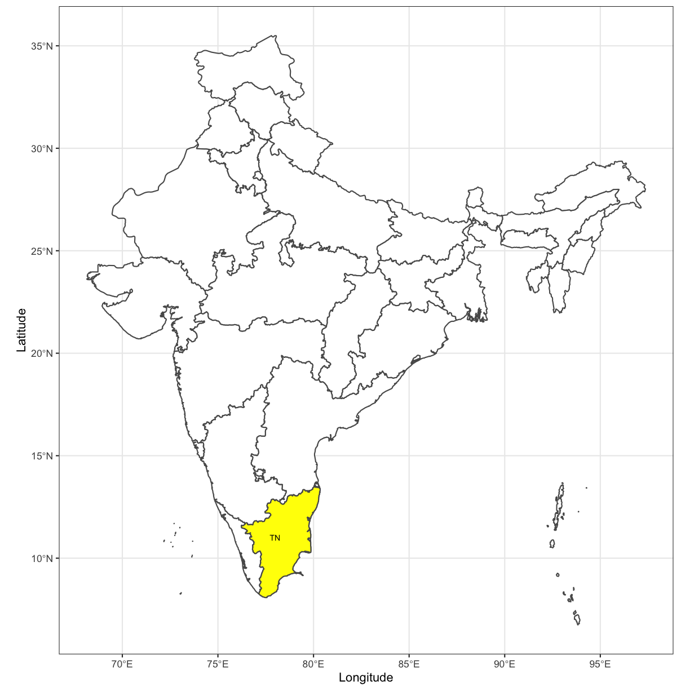

---
# Please do not edit this file directly; it is auto generated.
# Instead, please edit 19-creating_country_and_state_maps.md in _episodes_rmd/
title: "Creating Country and State Level Maps"
teaching: 15
exercises: 10
questions:
- "How can I get outlines of countries or states in R?"
- "How do I highlight a specific state?"
objectives:
- "Understand how to retreive data for making maps."
- "Understand how to manipulate and subset data to create maps."
keypoints:
- "R has packages that make it easy to retrieve data and create maps."
- "The sf package works nicely with ggplot2 and tidyverse."
source: Rmd
---

In this first exercise we will use [_rnaturalearth_](https://github.com/ropenscilabs/rnaturalearth), [_simple features_](https://cran.r-project.org/web/packages/sf/vignettes/sf1.html) and
_ggplot2_ to create a map of India and states within India to use as the base of the maps we will create in these exercises.

## Create Country Level Map of India

This is our base layer, India, of the map from [Naturalearth.com](https://naturalearth.com/) using the base `plot()` to display these data.

Using `ne_states()` will return an `sf` object with state level information. There is also a `ne_countries()` to download country level outlines only as well.

~~~
library("rnaturalearth")

in_sf <- ne_states(geounit = "india",
                   returnclass = "sf")

plot(in_sf)
~~~
{: .language-r}

~~~
Warning: plotting the first 9 out of 83 attributes; use max.plot = 83 to plot
all
~~~
{: .warning}

### Plot using `ggplot2`

Using _ggplot2_, we have more control over how the data are displayed.

First plot the whole country using `ggplot()`.

~~~
library("ggplot2")

india <- ggplot(in_sf) +
  geom_sf(fill = "white")

india
~~~
{: .language-r}

### Add Labels to the States

The naturalearth data have several columns to work with. One of them is the abbreviation for the states. Using `geom_text()`, we can add this information to the map. 

~~~
india <-
  india +
  geom_text(
    data = in_sf,
    aes(x = longitude,
        y = latitude,
        label = postal),
    size = 2.5,
    hjust = 1
  )

india
~~~
{: .language-r}

~~~
Warning: Removed 2 rows containing missing values (geom_text).
~~~
{: .warning}

### Final Touches

Properly label the x and y-axis and set the theme. The _ggplot2_ theme, `theme_bw()` is nice to use with maps so we will apply that here as well.

~~~
india <- 
  india +
  xlab("Longitude") +
  ylab("Latitude") +
  theme_bw()

india
~~~
{: .language-r}

~~~
Warning: Removed 2 rows containing missing values (geom_text).
~~~
{: .warning}

## Create Maps of Individual States

To create a map of only Andhra Pradesh, subset the _sf_ object, `india` such that it contains only the data for Andhra Pradesh.

### Inspect Column Names in `in_sf` Object

To find out what the column names are, we can use, `colnames()`.

~~~
names(in_sf)
~~~
{: .language-r}

~~~
 [1] "featurecla" "scalerank"  "adm1_code"  "diss_me"    "iso_3166_2"
 [6] "wikipedia"  "iso_a2"     "adm0_sr"    "name"       "name_alt"  
[11] "name_local" "type"       "type_en"    "code_local" "code_hasc" 
[16] "note"       "hasc_maybe" "region"     "region_cod" "provnum_ne"
[21] "gadm_level" "check_me"   "datarank"   "abbrev"     "postal"    
[26] "area_sqkm"  "sameascity" "labelrank"  "name_len"   "mapcolor9" 
[31] "mapcolor13" "fips"       "fips_alt"   "woe_id"     "woe_label" 
[36] "woe_name"   "latitude"   "longitude"  "sov_a3"     "adm0_a3"   
[41] "adm0_label" "admin"      "geonunit"   "gu_a3"      "gn_id"     
[46] "gn_name"    "gns_id"     "gns_name"   "gn_level"   "gn_region" 
[51] "gn_a1_code" "region_sub" "sub_code"   "gns_level"  "gns_lang"  
[56] "gns_adm1"   "gns_region" "min_label"  "max_label"  "min_zoom"  
[61] "wikidataid" "name_ar"    "name_bn"    "name_de"    "name_en"   
[66] "name_es"    "name_fr"    "name_el"    "name_hi"    "name_hu"   
[71] "name_id"    "name_it"    "name_ja"    "name_ko"    "name_nl"   
[76] "name_pl"    "name_pt"    "name_ru"    "name_sv"    "name_tr"   
[81] "name_vi"    "name_zh"    "ne_id"      "geometry"  
~~~
{: .output}

We see that a column named "name" exists, with the name of each state.

We can use this to `filter()` the data so that it only represents Andhra Pradesh and we can use that to make a map.

For more on subsetting _sf_ objects, see: <https://cran.rstudio.com/web/packages/sf/vignettes/sf4.html>

### Filter Andhra Pradesh

~~~
library("dplyr")
~~~
{: .language-r}

~~~

Attaching package: 'dplyr'
~~~
{: .output}

~~~
The following objects are masked from 'package:stats':

    filter, lag
~~~
{: .output}

~~~
The following objects are masked from 'package:base':

    intersect, setdiff, setequal, union
~~~
{: .output}

~~~
ap <- filter(in_sf, name == "Andhra Pradesh")

ap
~~~
{: .language-r}

~~~
Simple feature collection with 1 feature and 83 fields
geometry type:  MULTIPOLYGON
dimension:      XY
bbox:           xmin: 76.72 ymin: 12.63 xmax: 84.78 ymax: 19.89
CRS:            +proj=longlat +datum=WGS84 +no_defs +ellps=WGS84 +towgs84=0,0,0
          featurecla scalerank adm1_code diss_me iso_3166_2 wikipedia iso_a2
1 Admin-1 scale rank         2  IND-2441    2441      IN-AP      <NA>     IN
  adm0_sr           name name_alt name_local  type type_en code_local code_hasc
1       6 Andhra Pradesh     <NA>       <NA> State   State       <NA>     IN.AD
  note hasc_maybe region region_cod provnum_ne gadm_level check_me datarank
1 <NA>       <NA>  South       <NA>      20004          1       20        1
  abbrev postal area_sqkm sameascity labelrank name_len mapcolor9 mapcolor13
1   <NA>     AP         0         NA         2       14         2          2
  fips fips_alt  woe_id                 woe_label       woe_name latitude
1 IN02     <NA> 2345740 Andhra Pradesh, IN, India Andhra Pradesh    16.49
  longitude sov_a3 adm0_a3 adm0_label admin geonunit gu_a3   gn_id
1     79.21    IND     IND          2 India    India   IND 1278629
                  gn_name   gns_id                 gns_name gn_level gn_region
1 State of Andhra Pradesh -2088875 Andhra Pradesh, State of        1      <NA>
  gn_a1_code region_sub sub_code gns_level gns_lang gns_adm1 gns_region
1      IN.02       <NA>     <NA>         1      nld     IN02       <NA>
  min_label max_label min_zoom wikidataid name_ar name_bn        name_de
1       4.6      10.1      4.6      Q1159    <NA>    <NA> Andhra Pradesh
         name_en        name_es        name_fr name_el name_hi       name_hu
1 Andhra Pradesh Andhra Pradesh Andhra Pradesh    <NA>    <NA> Ándhra Prades
         name_id        name_it name_ja name_ko        name_nl        name_pl
1 Andhra Pradesh Andhra Pradesh    <NA>    <NA> Andhra Pradesh Andhra Pradesh
         name_pt name_ru        name_sv       name_tr        name_vi name_zh
1 Andhra Pradesh    <NA> Andhra Pradesh Andhra Prades Andhra Pradesh    <NA>
       ne_id                       geometry
1 1159311629 MULTIPOLYGON (((80.97 15.8,...
~~~
{: .output}

### Plot Andhra Pradesh

~~~
ggplot(data = ap) +
  geom_sf() +
  xlab("Longitude") +
  ylab("Latitude") +
  theme_bw()
~~~
{: .language-r}

## Highlighting States Within the Country

Using the `in_sf` and `ap` objects that we have created, it is possible to create a map that highlights one state and labels it using the abbreviation, in this case Andhra Pradesh.

~~~
ggplot(data = in_sf) +
  geom_sf(fill = "white") +
  geom_sf(
    data = ap,
    fill = "red") +
  geom_text(
    data = ap,
    aes(x = longitude,
        y = latitude,
        label = postal),
    size = 2.5,
    hjust = 1) +
  xlab("Longitude") +
  ylab("Latitude") +
  theme_bw()
~~~
{: .language-r}

> ## Challenge 1
>
> Create a map of India that highlights another state of your choice and label
> only that state.
> Make the state a different colour other than red.
>
> > ## Solution to Challenge 1
> >
> >~~~
> > tn <- filter(in_sf, name == "Tamil Nadu")
> > 
> > ggplot(data = in_sf) +
> >  geom_sf(fill = "white") +
> >  geom_sf(
> >    data = tn,
> >    fill = "yellow") +
> >  geom_text(
> >    data = tn,
> >    aes(x = longitude,
> >        y = latitude,
> >        label = postal),
> >    size = 2.5,
> >    hjust = 1) +
> >  xlab("Longitude") +
> >  ylab("Latitude") +
> >  theme_bw()
> >~~~
> >{: .language-r}
> >
> >
> {: .solution}
>
{: .challenge}

