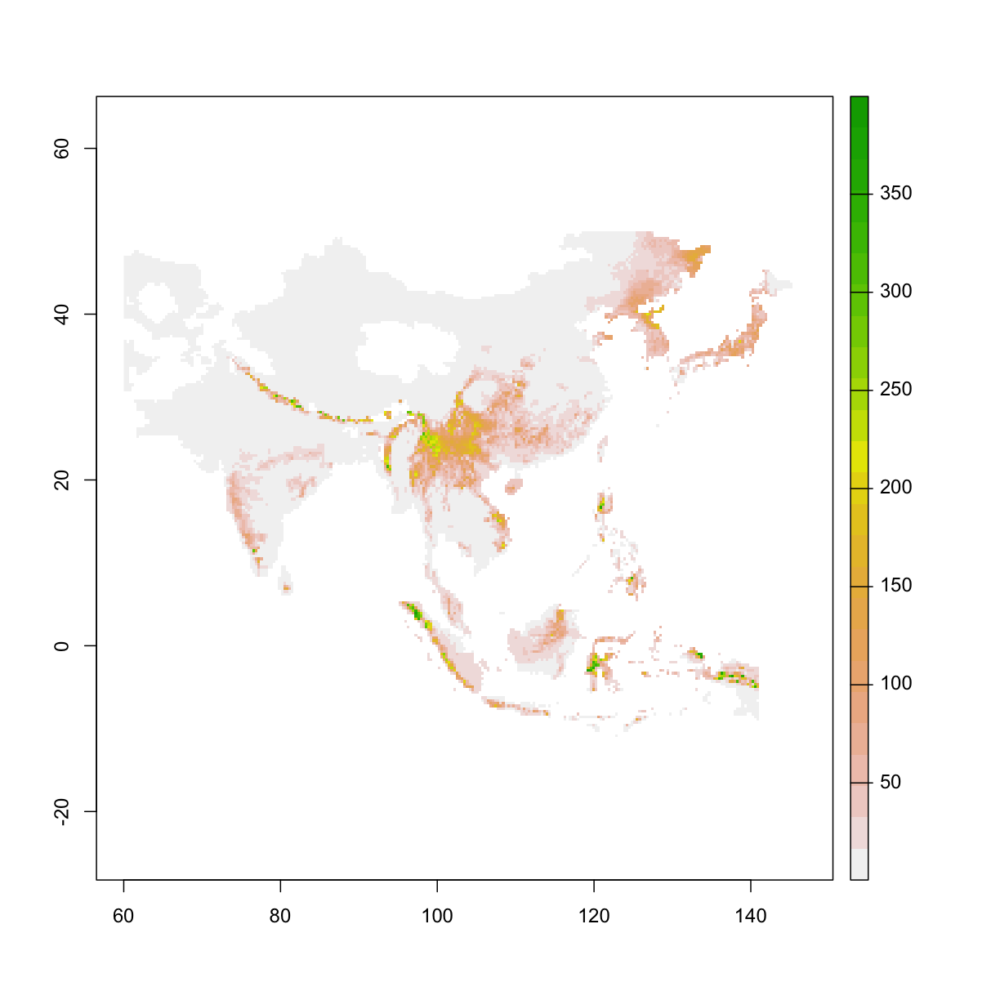
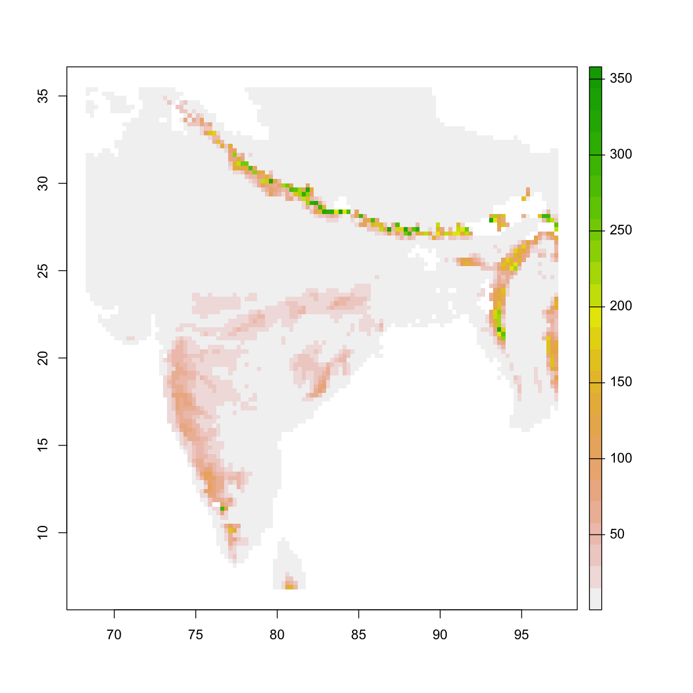
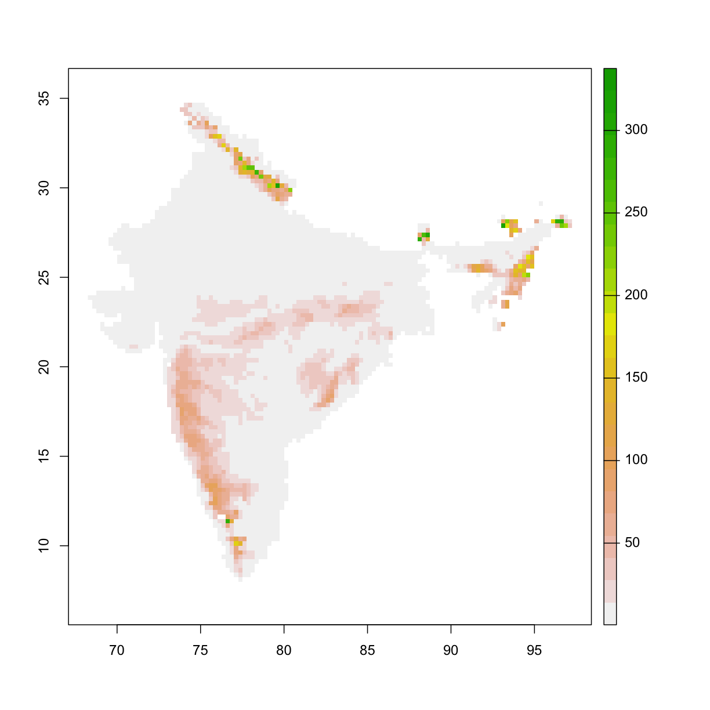
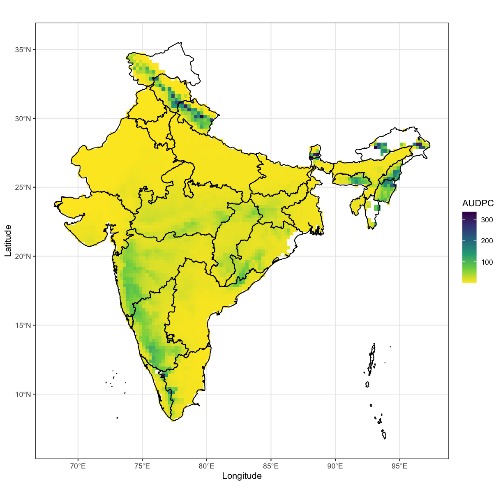
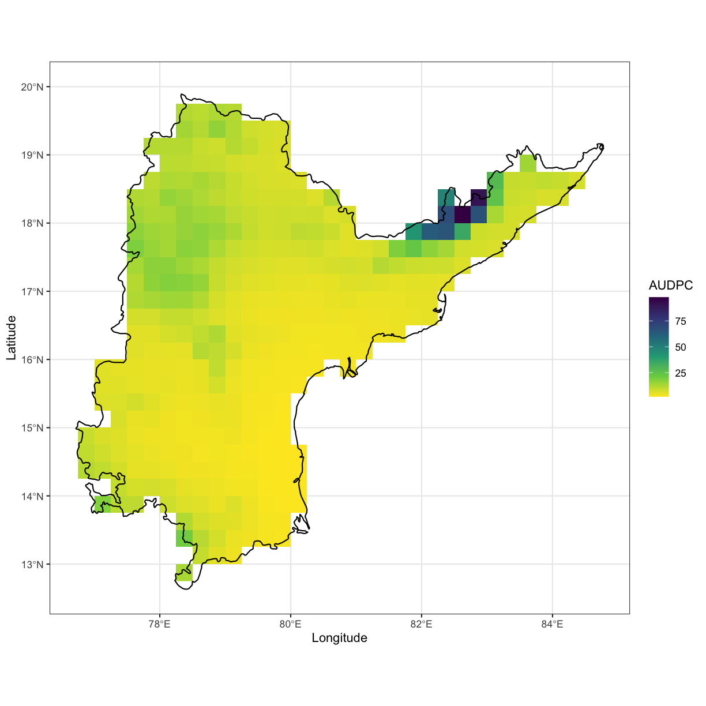

---
# Please do not edit this file directly; it is auto generated.
# Instead, please edit 20-mapping_model_outputs.md in _episodes_rmd/
title: "Interpreting Model Outputs"
teaching: 30
exercises: 20
questions:
- "How can I load model outputs and combine them with country or state outlines?"
- "How do I interpret my map?"
objectives:
- "Understand how to combine different sources of data in one map."
- "Gain experience interpreting model outputs as maps."
keypoints:
- "Use your knowledge of the real world to interpret model outputs."
source: Rmd
---

In this episode, we will work with data to generate maps of rice leaf blast using data from the Stress-Tolerant Rice for Africa and South Asia (STRASA) project.
These files are generated from outputs of the EPIRICE model (Savary et al. 2012).

## Load Model Output Data

First download the data from GitHub using `download.file()`.
For more on how to use this command, see `?download.file()`.

Using the terra package, load and plot the EPIRICE output.
This file represents the average leaf blast AUDPC for Asian rice grown during the primary growing season for each respective raster cell displayed for the years 2001 - 2008.

~~~
library("terra")
~~~
{: .language-r}

~~~
terra version 0.8.6 (beta-release)
~~~
{: .output}

~~~
download.file(url = "https://github.com/adamhsparks/ICRISAT_workshop/blob/gh-pages/data/EPIRICE.tif?raw=true",
              destfile = "data/EPIRICE.tif")
epirice <- rast("data/EPIRICE.tif")
plot(epirice)
~~~
{: .language-r}

## Crop the Model Output for India Only

There is much of the map outside of India, cropping using the sf object for India will remove extra data from the model output.
To do this we use the `crop()` command from terra with the `in_sf` object.

~~~
epirice_crop <- crop(x = epirice,
                     y = in_sf)
plot(epirice_crop)
~~~
{: .language-r}

## Mask the Model Output for India Only

We can see from the plot above, that there is still much data shown that represent other areas outside of India.
To convert an area outside of Indian borders to `NA` we can use the `mask()` command from terra.
We need to wrap the `in_sf` object in a special function, `vect()` to do this step.

~~~
epirice_mask <- mask(x = epirice_crop,
                     mask = vect(in_sf))
~~~
{: .language-r}

~~~
Warning in showSRID(uprojargs, format = "PROJ", multiline = "NO"): Discarded datum Unknown based on WGS84 ellipsoid in CRS definition,
 but +towgs84= values preserved
~~~
{: .warning}

~~~
plot(epirice_mask)
~~~
{: .language-r}

## Plot the Model Output Using ggplot2 for Interpretation

Now that we have cleaned up all of the extra data in the map, we're ready to plot it using ggplot2.

First we will convert the `epirice_mask` object to a `data.frame()` that we can use with `ggplot2::geom_raster()`.

~~~
library("ggplot2")
in_lb <- as.data.frame(epirice_mask, xy = TRUE)

in_lb <-
  ggplot() +
  geom_raster(data = in_lb, aes(x = x, y = y, fill = X2001_60_147_.12_50_blast_audpc)) +
  scale_fill_viridis_c("AUDPC", na.value = NA, direction = -1) +
  xlab("Longitude") +
  ylab("Latitude") +
  theme_bw() +
  coord_quickmap()
~~~
{: .language-r}

### Adding State Outlines

Remember how we learned that ggplot2 uses layers to construct the plots?
We can now add the state outlines on top of the minimum temperatures as a new layer.
Using the `in_sf` object and `geom_sf()` will add state outlines.
However, `fill` must be set to `NA` or the polygons will be filled with a default grey colour and you won't see the AUDPC values behind them.

~~~
in_lb +
  geom_sf(data = in_sf,
          fill = NA,
          colour = "black") +
  theme_bw() +
  coord_sf()
~~~
{: .language-r}

> ## Challenge 1
>
> How would you interpret this map for someone unfamiliar with rice leaf blast?
> What can you say about where it seems to occur most frequently?
> Does this map match your expecations of the areas where the disease is the worst?
> Are there areas that appear low but should be high or vice-versa?
>
> ## Challenge 2
>
> Make a map of the leaf blast AUDPC output for a single state of your choice in India.
>
> > ## Solution to Challenge 2
> > Using Andrah Pradesh from episode 17 we can do it this way.
> >
> >~~~
> > library("dplyr")
> >~~~
> >{: .language-r}
> >
> >
> >
> >~~~
> >
> >Attaching package: 'dplyr'
> >~~~
> >{: .output}
> >
> >
> >
> >~~~
> >The following object is masked from 'package:terra':
> >
> >    select
> >~~~
> >{: .output}
> >
> >
> >
> >~~~
> >The following objects are masked from 'package:stats':
> >
> >    filter, lag
> >~~~
> >{: .output}
> >
> >
> >
> >~~~
> >The following objects are masked from 'package:base':
> >
> >    intersect, setdiff, setequal, union
> >~~~
> >{: .output}
> >
> >
> >
> >~~~
> > ap <- filter(in_sf, name == "Andhra Pradesh")
> >
> > epirice_crop <- crop(x = epirice,
> >                      y = ap)
> > epirice_mask = mask(x = epirice_crop,
> >                     mask = vect(ap))
> >~~~
> >{: .language-r}
> >
> >
> >
> >~~~
> >Warning in showSRID(uprojargs, format = "PROJ", multiline = "NO"): Discarded datum Unknown based on WGS84 ellipsoid in CRS definition,
> > but +towgs84= values preserved
> >~~~
> >{: .warning}
> >
> >
> >
> >~~~
> > ap_lb <- as.data.frame(epirice_mask, xy = TRUE)
> >
> > ggplot() +
> >   geom_raster(data = ap_lb, aes(x = x,
> >                                 y = y,
> >                                 fill = X2001_60_147_.12_50_blast_audpc)) +
> >   scale_fill_viridis_c("AUDPC", na.value = NA, direction = -1) +
> >   geom_sf(data = ap,
> >           fill = NA,
> >           colour = "black") +
> >   xlab("Longitude") +
> >   ylab("Latitude") +
> >   theme_bw()
> >~~~
> >{: .language-r}
> >
> >
> >
> >~~~
> >Warning: Removed 554 rows containing missing values (geom_raster).
> >~~~
> >{: .warning}
> >
> >
> {: .solution}
{: .challenge}
